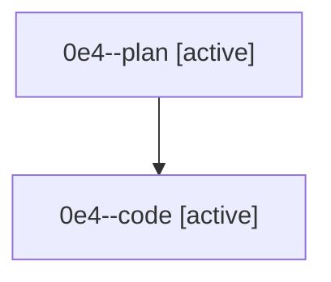

# Family: 0e4

[Agent Hoods](../README.md) / [bbugyi200](../users/bbugyi200/README.md) / [athena](../users/bbugyi200/machines/athena/README.md) / [0e4](../users/bbugyi200/machines/athena/hoods/0e4/README.md) / 0e4

Owner: `bbugyi200.athena` · Hood: `0e4` · Members: 2

## Lineage

The diagram is an optional enhancement; the ordered table below contains the same lineage in accessible text.

| Role | Agent | State | Model / provider | Timing | Commits | Prompt | Chat |
|---|---|---|---|---|---:|---|---|
| plan | 0e4--plan | active | opus / claude | 2026-08-26T11:54:47.935276+00:00 | 0 | [Prompt](../agents/bbugyi200.athena.0e4--plan/prompt.md) | [Chat](../agents/bbugyi200.athena.0e4--plan/chat.md) |
| code | 0e4--code | active | sonnet / claude | 2026-08-26T12:19:01.839138+00:00 | 0 | — | — |
