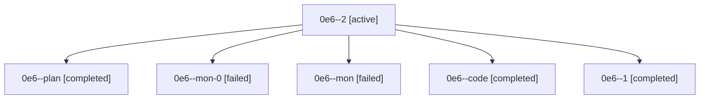

# Family: 0e6

[Agent Hoods](../README.md) / [bbugyi200](../users/bbugyi200/README.md) / [athena](../users/bbugyi200/machines/athena/README.md) / [0e6](../users/bbugyi200/machines/athena/hoods/0e6/README.md) / 0e6

Owner: `bbugyi200.athena` · Hood: `0e6` · Members: 6

## Lineage

The diagram is an optional enhancement; the ordered table below contains the same lineage in accessible text.

| Role | Agent | State | Model / provider | Timing | Commits | Prompt | Chat |
|---|---|---|---|---|---:|---|---|
| 2 | 0e6--2 | active | sonnet / claude | 2026-08-26T13:40:36.171309+00:00 | [1](../agents/bbugyi200.athena.0e6--2/README.md#commits) | [Prompt](../agents/bbugyi200.athena.0e6--2/prompt.md) | — |
| plan | 0e6--plan | completed | opus / claude | 2026-08-26T12:00:54.942253+00:00 → 2026-08-26T13:01:22.649727+00:00 | 0 | [Prompt](../agents/bbugyi200.athena.0e6--plan/prompt.md) | [Chat](../agents/bbugyi200.athena.0e6--plan/chat.md) |
| mon-0 | 0e6--mon-0 | failed | gpt-5.5 / codex | 2026-08-26T13:22:42.440899+00:00 | 0 | — | [Chat](../agents/bbugyi200.athena.0e6--mon-0/chat.md) |
| mon | 0e6--mon | failed | gpt-5.5 / codex | 2026-08-26T13:00:52.183607+00:00 | 0 | — | [Chat](../agents/bbugyi200.athena.0e6--mon/chat.md) |
| code | 0e6--code | completed | gpt-5.5 / codex | 2026-08-26T12:31:26.065206+00:00 → 2026-08-26T13:01:22.649727+00:00 | 0 | — | [Chat](../agents/bbugyi200.athena.0e6--code/chat.md) |
| 1 | 0e6--1 | completed | gpt-5.5 / codex | 2026-08-26T13:20:15.732942+00:00 → 2026-08-26T13:22:58.807767+00:00 | 0 | [Prompt](../agents/bbugyi200.athena.0e6--1/prompt.md) | [Chat](../agents/bbugyi200.athena.0e6--1/chat.md) |

## Commits

| Role | Repo | Commit | Subject | Committed |
|---|---|---|---|---|
| 2 | sase | [`1795085`](https://github.com/sase-org/sase/commit/179508566ab85654ec67a340f001fa2a361ab503) | fix: repair the three deterministic master CI failure clusters | 2026-08-26 09:45:55 EDT |
