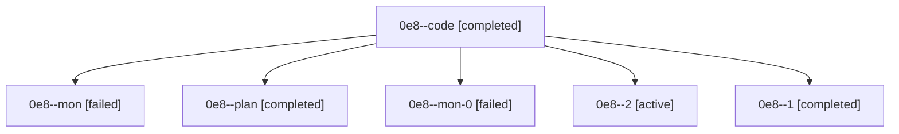

# Family: 0e8

[Agent Hoods](../README.md) / [bbugyi200](../users/bbugyi200/README.md) / [athena](../users/bbugyi200/machines/athena/README.md) / [0e8](../users/bbugyi200/machines/athena/hoods/0e8/README.md) / 0e8

Owner: `bbugyi200.athena` · Hood: `0e8` · Members: 6

## Lineage

The diagram is an optional enhancement; the ordered table below contains the same lineage in accessible text.

| Role | Agent | State | Model / provider | Timing | Commits | Prompt | Chat |
|---|---|---|---|---|---:|---|---|
| code | 0e8--code | completed | sonnet / claude | 2026-08-26T13:22:24.959516+00:00 → 2026-08-26T13:47:03.130997+00:00 | 0 | — | [Chat](../agents/bbugyi200.athena.0e8--code/chat.md) |
| mon | 0e8--mon | failed | sonnet / claude | 2026-08-26T13:46:53.739346+00:00 | 0 | — | [Chat](../agents/bbugyi200.athena.0e8--mon/chat.md) |
| plan | 0e8--plan | completed | opus / claude | 2026-08-26T13:14:42.269900+00:00 → 2026-08-26T13:47:03.130997+00:00 | 0 | [Prompt](../agents/bbugyi200.athena.0e8--plan/prompt.md) | [Chat](../agents/bbugyi200.athena.0e8--plan/chat.md) |
| mon-0 | 0e8--mon-0 | failed | gpt-5.5 / codex | 2026-08-26T14:15:02.383432+00:00 | 0 | — | [Chat](../agents/bbugyi200.athena.0e8--mon-0/chat.md) |
| 2 | 0e8--2 | active | gpt-5.5 / codex | 2026-08-26T14:33:28.170001+00:00 | [1](../agents/bbugyi200.athena.0e8--2/README.md#commits) | [Prompt](../agents/bbugyi200.athena.0e8--2/prompt.md) | — |
| 1 | 0e8--1 | completed | gpt-5.5 / codex | 2026-08-26T13:47:41.175131+00:00 → 2026-08-26T14:15:11.212311+00:00 | 0 | [Prompt](../agents/bbugyi200.athena.0e8--1/prompt.md) | [Chat](../agents/bbugyi200.athena.0e8--1/chat.md) |

## Commits

| Role | Repo | Commit | Subject | Committed |
|---|---|---|---|---|
| 2 | sase | [`a3b69bd`](https://github.com/sase-org/sase/commit/a3b69bd85bdbb83c24a457aad126e0891df233f7) | feat(tui): make Admin Center tab memory session-scoped | 2026-08-26 10:53:09 EDT |
