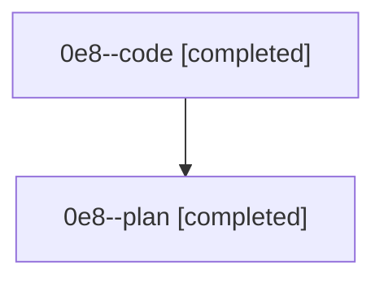

# Family: 0e8

[Agent Hoods](../README.md) / [bbugyi200](../users/bbugyi200/README.md) / [athena](../users/bbugyi200/machines/athena/README.md) / [0e8](../users/bbugyi200/machines/athena/hoods/0e8/README.md) / 0e8

Owner: `bbugyi200.athena` · Hood: `0e8` · Members: 2

## Lineage

The diagram is an optional enhancement; the ordered table below contains the same lineage in accessible text.

| Role | Agent | State | Model / provider | Timing | Commits | Prompt | Chat |
|---|---|---|---|---|---:|---|---|
| code | 0e8--code | completed | sonnet / claude | 2026-08-26T13:22:24.959516+00:00 → 2026-08-26T13:47:03.130997+00:00 | 0 | — | [Chat](../agents/bbugyi200.athena.0e8--code/chat.md) |
| plan | 0e8--plan | completed | opus / claude | 2026-08-26T13:14:42.269900+00:00 → 2026-08-26T13:47:03.130997+00:00 | 0 | [Prompt](../agents/bbugyi200.athena.0e8--plan/prompt.md) | [Chat](../agents/bbugyi200.athena.0e8--plan/chat.md) |
