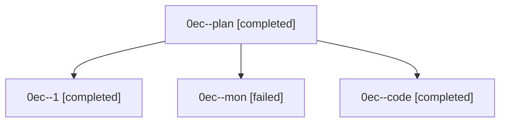

# Family: 0ec

[Agent Hoods](../README.md) / [bbugyi200](../users/bbugyi200/README.md) / [athena](../users/bbugyi200/machines/athena/README.md) / [0ec](../users/bbugyi200/machines/athena/hoods/0ec/README.md) / 0ec

Owner: `bbugyi200.athena` · Hood: `0ec` · Members: 4

## Lineage

The diagram is an optional enhancement; the ordered table below contains the same lineage in accessible text.

| Role | Agent | State | Model / provider | Timing | Commits | Prompt | Chat |
|---|---|---|---|---|---:|---|---|
| plan | 0ec--plan | completed | opus / claude | 2026-08-26T14:39:39.605308+00:00 → 2026-08-26T15:43:20.103189+00:00 | 0 | [Prompt](../agents/bbugyi200.athena.0ec--plan/prompt.md) | [Chat](../agents/bbugyi200.athena.0ec--plan/chat.md) |
| 1 | 0ec--1 | completed | gpt-5.5 / codex | 2026-08-26T16:01:53.229319+00:00 → 2026-08-26T16:06:11.503091+00:00 | [1](../agents/bbugyi200.athena.0ec--1/README.md#commits) | [Prompt](../agents/bbugyi200.athena.0ec--1/prompt.md) | [Chat](../agents/bbugyi200.athena.0ec--1/chat.md) |
| mon | 0ec--mon | failed | sonnet / claude | 2026-08-26T15:43:09.889232+00:00 | 0 | — | [Chat](../agents/bbugyi200.athena.0ec--mon/chat.md) |
| code | 0ec--code | completed | sonnet / claude | 2026-08-26T15:09:15.416971+00:00 → 2026-08-26T15:43:20.103189+00:00 | 0 | — | [Chat](../agents/bbugyi200.athena.0ec--code/chat.md) |

## Commits

| Role | Repo | Commit | Subject | Committed |
|---|---|---|---|---|
| 1 | sase | [`cc2d907`](https://github.com/sase-org/sase/commit/cc2d90721baf4188eb6e19b116fd594f89ea9bc4) | fix(sdd): bound artifact link backfill reconciliation | 2026-08-26 12:03:27 EDT |
