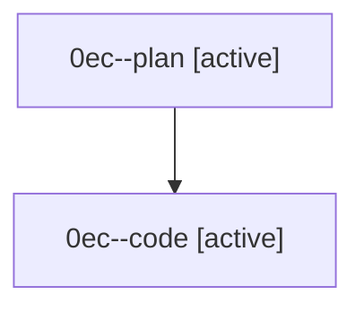

# Family: 0ec

[Agent Hoods](../README.md) / [bbugyi200](../users/bbugyi200/README.md) / [athena](../users/bbugyi200/machines/athena/README.md) / [0ec](../users/bbugyi200/machines/athena/hoods/0ec/README.md) / 0ec

Owner: `bbugyi200.athena` · Hood: `0ec` · Members: 2

## Lineage

The diagram is an optional enhancement; the ordered table below contains the same lineage in accessible text.

| Role | Agent | State | Model / provider | Timing | Commits | Prompt | Chat |
|---|---|---|---|---|---:|---|---|
| plan | 0ec--plan | active | opus / claude | 2026-08-26T14:39:39.605308+00:00 | 0 | [Prompt](../agents/bbugyi200.athena.0ec--plan/prompt.md) | [Chat](../agents/bbugyi200.athena.0ec--plan/chat.md) |
| code | 0ec--code | active | sonnet / claude | 2026-08-26T15:09:15.416971+00:00 | 0 | — | — |
