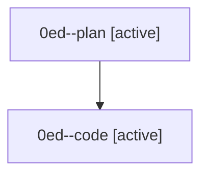

# Family: 0ed

[Agent Hoods](../README.md) / [bbugyi200](../users/bbugyi200/README.md) / [athena](../users/bbugyi200/machines/athena/README.md) / [0ed](../users/bbugyi200/machines/athena/hoods/0ed/README.md) / 0ed

Owner: `bbugyi200.athena` · Hood: `0ed` · Members: 2

## Lineage

The diagram is an optional enhancement; the ordered table below contains the same lineage in accessible text.

| Role | Agent | State | Model / provider | Timing | Commits | Prompt | Chat |
|---|---|---|---|---|---:|---|---|
| plan | 0ed--plan | active | opus / claude | 2026-08-26T15:11:39.226233+00:00 | 0 | [Prompt](../agents/bbugyi200.athena.0ed--plan/prompt.md) | [Chat](../agents/bbugyi200.athena.0ed--plan/chat.md) |
| code | 0ed--code | active | gpt-5.5 / codex | 2026-08-26T15:28:13.655160+00:00 | [1](../agents/bbugyi200.athena.0ed--code/README.md#commits) | — | — |

## Commits

| Role | Repo | Commit | Subject | Committed |
|---|---|---|---|---|
| code | sase | [`e6eccc5`](https://github.com/sase-org/sase/commit/e6eccc5fea6bb4c9b8561267824fbc50753b100b) | feat(tui): group notification modal beads by type | 2026-08-26 12:09:14 EDT |
