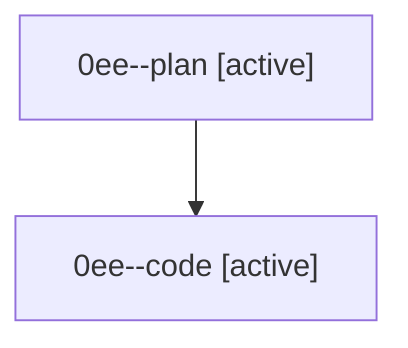

# Family: 0ee

[Agent Hoods](../README.md) / [bbugyi200](../users/bbugyi200/README.md) / [athena](../users/bbugyi200/machines/athena/README.md) / [0ee](../users/bbugyi200/machines/athena/hoods/0ee/README.md) / 0ee

Owner: `bbugyi200.athena` · Hood: `0ee` · Members: 2

## Lineage

The diagram is an optional enhancement; the ordered table below contains the same lineage in accessible text.

| Role | Agent | State | Model / provider | Timing | Commits | Prompt | Chat |
|---|---|---|---|---|---:|---|---|
| plan | 0ee--plan | active | opus / claude | 2026-08-26T15:27:52.028256+00:00 | 0 | [Prompt](../agents/bbugyi200.athena.0ee--plan/prompt.md) | [Chat](../agents/bbugyi200.athena.0ee--plan/chat.md) |
| code | 0ee--code | active | sonnet / claude | 2026-08-26T15:59:37.463508+00:00 | [1](../agents/bbugyi200.athena.0ee--code/README.md#commits) | — | — |

## Commits

| Role | Repo | Commit | Subject | Committed |
|---|---|---|---|---|
| code | sase | [`4a987d8`](https://github.com/sase-org/sase/commit/4a987d8e8b2afeda8df636d04ceeee50b289a670) | docs(memory): add sase-gate glossary strand | 2026-08-26 12:05:41 EDT |
