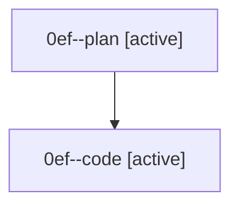

# Family: 0ef

[Agent Hoods](../README.md) / [bbugyi200](../users/bbugyi200/README.md) / [athena](../users/bbugyi200/machines/athena/README.md) / [0ef](../users/bbugyi200/machines/athena/hoods/0ef/README.md) / 0ef

Owner: `bbugyi200.athena` · Hood: `0ef` · Members: 2

## Lineage

The diagram is an optional enhancement; the ordered table below contains the same lineage in accessible text.

| Role | Agent | State | Model / provider | Timing | Commits | Prompt | Chat |
|---|---|---|---|---|---:|---|---|
| plan | 0ef--plan | active | gpt-5.6-sol / codex | 2026-08-26T16:19:31.467633+00:00 | 0 | [Prompt](../agents/bbugyi200.athena.0ef--plan/prompt.md) | [Chat](../agents/bbugyi200.athena.0ef--plan/chat.md) |
| code | 0ef--code | active | sonnet / claude | 2026-08-26T16:23:20.317731+00:00 | [1](../agents/bbugyi200.athena.0ef--code/README.md#commits) | — | — |

## Commits

| Role | Repo | Commit | Subject | Committed |
|---|---|---|---|---|
| code | sase | [`95dc60c`](https://github.com/sase-org/sase/commit/95dc60c5aa2fc1ddf649d3bd46fac6e9c0e75c01) | feat(memory): add MEMORY FILE header to multi-note selector batch renders | 2026-08-26 12:28:41 EDT |
