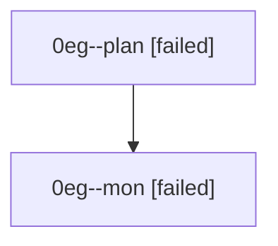

# Family: 0eg

[Agent Hoods](../README.md) / [bbugyi200](../users/bbugyi200/README.md) / [athena](../users/bbugyi200/machines/athena/README.md) / [0eg](../users/bbugyi200/machines/athena/hoods/0eg/README.md) / 0eg

Owner: `bbugyi200.athena` · Hood: `0eg` · Members: 2

## Lineage

The diagram is an optional enhancement; the ordered table below contains the same lineage in accessible text.

| Role | Agent | State | Model / provider | Timing | Commits | Prompt | Chat |
|---|---|---|---|---|---:|---|---|
| plan | 0eg--plan | failed | opus / claude | 2026-08-26T17:48:36.192172+00:00 → 2026-08-26T18:02:38.840290+00:00 | 0 | [Prompt](../agents/bbugyi200.athena.0eg--plan/prompt.md) | [Chat](../agents/bbugyi200.athena.0eg--plan/chat.md) |
| mon | 0eg--mon | failed | opus / claude | 2026-08-26T18:02:45.831189+00:00 | 0 | — | [Chat](../agents/bbugyi200.athena.0eg--mon/chat.md) |
