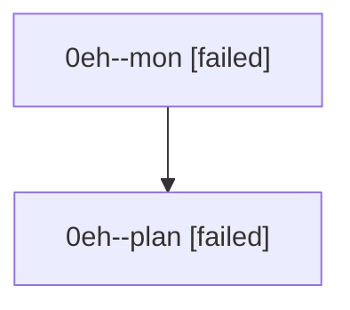

# Family: 0eh

[Agent Hoods](../README.md) / [bbugyi200](../users/bbugyi200/README.md) / [athena](../users/bbugyi200/machines/athena/README.md) / [0eh](../users/bbugyi200/machines/athena/hoods/0eh/README.md) / 0eh

Owner: `bbugyi200.athena` · Hood: `0eh` · Members: 2

## Lineage

The diagram is an optional enhancement; the ordered table below contains the same lineage in accessible text.

| Role | Agent | State | Model / provider | Timing | Commits | Prompt | Chat |
|---|---|---|---|---|---:|---|---|
| mon | 0eh--mon | failed | opus / claude | 2026-08-26T18:48:19.310614+00:00 | 0 | — | [Chat](../agents/bbugyi200.athena.0eh--mon/chat.md) |
| plan | 0eh--plan | failed | opus / claude | 2026-08-26T18:27:40.175417+00:00 → 2026-08-26T18:48:10.779771+00:00 | 0 | [Prompt](../agents/bbugyi200.athena.0eh--plan/prompt.md) | [Chat](../agents/bbugyi200.athena.0eh--plan/chat.md) |
