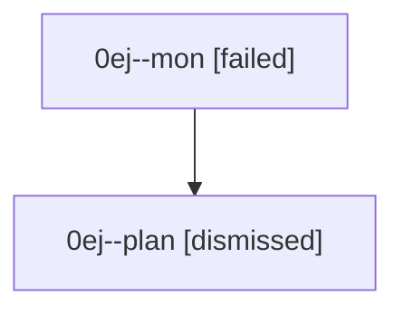

# Family: 0ej

[Agent Hoods](../README.md) / [bbugyi200](../users/bbugyi200/README.md) / [athena](../users/bbugyi200/machines/athena/README.md) / [0ej](../users/bbugyi200/machines/athena/hoods/0ej/README.md) / 0ej

Owner: `bbugyi200.athena` · Hood: `0ej` · Members: 2

## Lineage

The diagram is an optional enhancement; the ordered table below contains the same lineage in accessible text.

| Role | Agent | State | Model / provider | Timing | Commits | Prompt | Chat |
|---|---|---|---|---|---:|---|---|
| mon | 0ej--mon | failed | opus / claude | 2026-08-26T21:44:29.480175+00:00 | 0 | — | [Chat](../agents/bbugyi200.athena.0ej--mon/chat.md) |
| plan | 0ej--plan | dismissed | — | 2026-08-26T17:29:08 | 0 | — | — |
