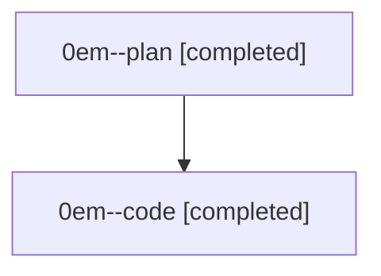

# Family: 0em

[Agent Hoods](../README.md) / [bbugyi200](../users/bbugyi200/README.md) / [athena](../users/bbugyi200/machines/athena/README.md) / [0em](../users/bbugyi200/machines/athena/hoods/0em/README.md) / 0em

Owner: `bbugyi200.athena` · Hood: `0em` · Members: 2

## Lineage

The diagram is an optional enhancement; the ordered table below contains the same lineage in accessible text.

| Role | Agent | State | Model / provider | Timing | Commits | Prompt | Chat |
|---|---|---|---|---|---:|---|---|
| plan | 0em--plan | completed | opus / claude | 2026-08-27T11:36:12.938397+00:00 → 2026-08-27T12:10:32.331844+00:00 | 0 | [Prompt](../agents/bbugyi200.athena.0em--plan/prompt.md) | [Chat](../agents/bbugyi200.athena.0em--plan/chat.md) |
| code | 0em--code | completed | sonnet / claude | 2026-08-27T11:51:00.303887+00:00 → 2026-08-27T12:10:32.331844+00:00 | [1](../agents/bbugyi200.athena.0em--code/README.md#commits) | — | [Chat](../agents/bbugyi200.athena.0em--code/chat.md) |

## Commits

| Role | Repo | Commit | Subject | Committed |
|---|---|---|---|---|
| code | sase | [`f49030d`](https://github.com/sase-org/sase/commit/f49030db66b134281bc447c9d367cd7aabad6d9c) | perf(ace-tui): cache provider\_source\_token and cascade tab cache invalidation | 2026-08-27 08:08:07 EDT |

## Neighbors

| Agent | Relation | State |
|---|---|---|
| [0em.f1](../agents/bbugyi200.athena.0em.f1/README.md) | descendant | completed |
