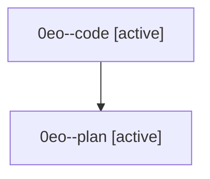

# Family: 0eo

[Agent Hoods](../README.md) / [bbugyi200](../users/bbugyi200/README.md) / [athena](../users/bbugyi200/machines/athena/README.md) / [0eo](../users/bbugyi200/machines/athena/hoods/0eo/README.md) / 0eo

Owner: `bbugyi200.athena` · Hood: `0eo` · Members: 2

## Lineage

The diagram is an optional enhancement; the ordered table below contains the same lineage in accessible text.

| Role | Agent | State | Model / provider | Timing | Commits | Prompt | Chat |
|---|---|---|---|---|---:|---|---|
| code | 0eo--code | active | gpt-5.5 / codex | 2026-08-27T12:39:27.281534+00:00 | 0 | — | — |
| plan | 0eo--plan | active | opus / claude | 2026-08-27T12:30:04.577316+00:00 | 0 | [Prompt](../agents/bbugyi200.athena.0eo--plan/prompt.md) | [Chat](../agents/bbugyi200.athena.0eo--plan/chat.md) |
