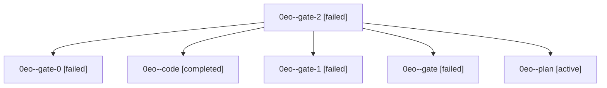

# Family: 0eo

[Agent Hoods](../README.md) / [bbugyi200](../users/bbugyi200/README.md) / [athena](../users/bbugyi200/machines/athena/README.md) / [0eo](../users/bbugyi200/machines/athena/hoods/0eo/README.md) / 0eo

Owner: `bbugyi200.athena` · Hood: `0eo` · Members: 6

## Lineage

The diagram is an optional enhancement; the ordered table below contains the same lineage in accessible text.

| Role | Agent | State | Model / provider | Timing | Commits | Prompt | Chat |
|---|---|---|---|---|---:|---|---|
| gate-2 | 0eo--gate-2 | failed | gpt-5.5 / codex | 2026-08-27T13:48:33.725885+00:00 → 2026-08-27T13:48:48.675093+00:00 | 0 | — | [Chat](../agents/bbugyi200.athena.0eo--gate-2/chat.md) |
| gate-0 | 0eo--gate-0 | failed | gpt-5.5 / codex | 2026-08-27T13:17:26.694280+00:00 → 2026-08-27T13:26:26.874816+00:00 | 0 | — | [Chat](../agents/bbugyi200.athena.0eo--gate-0/chat.md) |
| code | 0eo--code | completed | gpt-5.5 / codex | 2026-08-27T12:39:27.281534+00:00 → 2026-08-27T13:57:37.600988+00:00 | [1](../agents/bbugyi200.athena.0eo--code/README.md#commits) | — | [Chat](../agents/bbugyi200.athena.0eo--code/chat.md) |
| gate-1 | 0eo--gate-1 | failed | gpt-5.5 / codex | 2026-08-27T13:38:59.766285+00:00 → 2026-08-27T13:39:06.786079+00:00 | 0 | — | [Chat](../agents/bbugyi200.athena.0eo--gate-1/chat.md) |
| gate | 0eo--gate | failed | gpt-5.5 / codex | 2026-08-27T13:15:42.076801+00:00 → 2026-08-27T13:15:49.541062+00:00 | 0 | — | [Chat](../agents/bbugyi200.athena.0eo--gate/chat.md) |
| plan | 0eo--plan | active | opus / claude | 2026-08-27T12:30:04.577316+00:00 | 0 | [Prompt](../agents/bbugyi200.athena.0eo--plan/prompt.md) | [Chat](../agents/bbugyi200.athena.0eo--plan/chat.md) |

## Commits

| Role | Repo | Commit | Subject | Committed |
|---|---|---|---|---|
| code | sase | [`be63e9c`](https://github.com/sase-org/sase/commit/be63e9c7dcd35944ac51d7da8171677bbd499205) | fix(history): fall back when chat workspace helper is unavailable | 2026-08-27 09:52:39 EDT |
