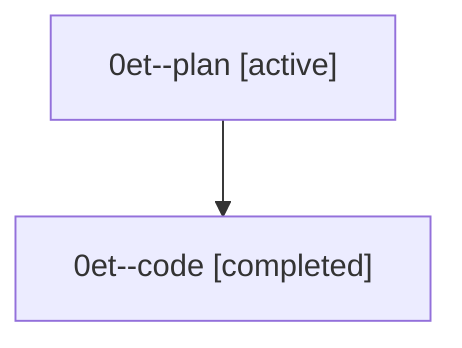

# Family: 0et

[Agent Hoods](../README.md) / [bbugyi200](../users/bbugyi200/README.md) / [athena](../users/bbugyi200/machines/athena/README.md) / [0et](../users/bbugyi200/machines/athena/hoods/0et/README.md) / 0et

Owner: `bbugyi200.athena` · Hood: `0et` · Members: 2

## Lineage

The diagram is an optional enhancement; the ordered table below contains the same lineage in accessible text.

| Role | Agent | State | Model / provider | Timing | Commits | Prompt | Chat |
|---|---|---|---|---|---:|---|---|
| plan | 0et--plan | active | opus / claude | 2026-08-27T13:47:09.705294+00:00 | 0 | [Prompt](../agents/bbugyi200.athena.0et--plan/prompt.md) | [Chat](../agents/bbugyi200.athena.0et--plan/chat.md) |
| code | 0et--code | completed | gpt-5.5 / codex | 2026-08-27T13:57:59.040988+00:00 → 2026-08-27T15:07:42.867900+00:00 | [1](../agents/bbugyi200.athena.0et--code/README.md#commits) | — | [Chat](../agents/bbugyi200.athena.0et--code/chat.md) |

## Commits

| Role | Repo | Commit | Subject | Committed |
|---|---|---|---|---|
| code | sase | [`7e1214c`](https://github.com/sase-org/sase/commit/7e1214ced961376fa623f5115d204c9321c6eb02) | fix(agent): guard runner slots against pid recycling | 2026-08-27 11:06:55 EDT |
