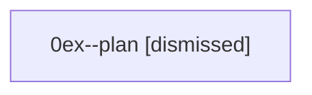

# Family: 0ex

[Agent Hoods](../README.md) / [bbugyi200](../users/bbugyi200/README.md) / [athena](../users/bbugyi200/machines/athena/README.md) / [0ex](../users/bbugyi200/machines/athena/hoods/0ex/README.md) / 0ex

Owner: `bbugyi200.athena` · Hood: `0ex` · Members: 1

## Lineage

The diagram is an optional enhancement; the ordered table below contains the same lineage in accessible text.

| Role | Agent | State | Model / provider | Timing | Commits | Prompt | Chat |
|---|---|---|---|---|---:|---|---|
| plan | 0ex--plan | dismissed | — | 2026-08-27T11:34:57 | 0 | — | — |
