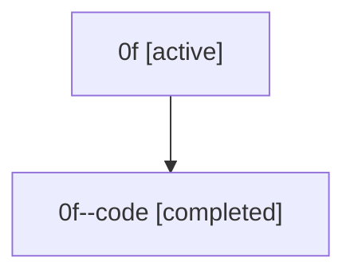

# Family: 0f

Owner: `bbugyi200.athena` · Hood: `0f` · Members: 2

## Lineage

The diagram is an optional enhancement; the ordered table below contains the same lineage in accessible text.

| Role | Agent | State | Model / provider | Timing | Commits | Prompt | Chat |
|---|---|---|---|---|---:|---|---|
| root | 0f | active | claude-fable-5 / claude | 2026-07-07T15:04:36.986070+00:00 | 4 | [Prompt](../agents/bbugyi200.athena.0f/prompt.md) | [Chat](../agents/bbugyi200.athena.0f/chat.md) |
| code | 0f--code | completed | gpt-5.5 / codex | 2026-07-07T15:13:24.782950+00:00 | 0 | — | [Chat](../agents/bbugyi200.athena.0f--code/chat.md) |
