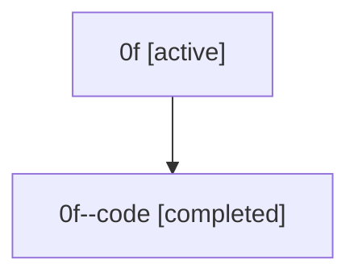

# Family: 0f

[Agent Hoods](../README.md) / [bbugyi200](../users/bbugyi200/README.md) / [athena](../users/bbugyi200/machines/athena/README.md) / [0f](../users/bbugyi200/machines/athena/hoods/0f/README.md) / 0f

Owner: `bbugyi200.athena` · Hood: `0f` · Members: 2

## Lineage

The diagram is an optional enhancement; the ordered table below contains the same lineage in accessible text.

| Role | Agent | State | Model / provider | Timing | Commits | Prompt | Chat |
|---|---|---|---|---|---:|---|---|
| root | 0f | active | claude-fable-5 / claude | 2026-07-07T15:04:36.986070+00:00 | [4](../agents/bbugyi200.athena.0f/README.md#commits) | [Prompt](../agents/bbugyi200.athena.0f/prompt.md) | [Chat](../agents/bbugyi200.athena.0f/chat.md) |
| code | 0f--code | completed | gpt-5.5 / codex | 2026-07-07T15:13:24.782950+00:00 | 0 | — | [Chat](../agents/bbugyi200.athena.0f--code/chat.md) |

## Commits

| Role | Repo | Commit | Subject | Committed (UTC) |
|---|---|---|---|---|
| root | sase | [`96c4c83`](https://github.com/sase-org/sase/commit/96c4c8329876c743e8ae20a0a8dfd91325159fa8) | chore: Add SDD prompt and plan for fix\_ci\_tz\_day\_boundary\_flake | 2026-07-06 02:18:52 |
| root | sase | [`417c39a`](https://github.com/sase-org/sase/commit/417c39ad05978b890fde7ec988cef7cf47e44dbc) | test: align wait time expectations with local clock | 2026-07-06 02:39:37 |
| root | sase | [`2c76165`](https://github.com/sase-org/sase/commit/2c7616528b9572378fcc129ea73db20dcf3a4cd3) | chore: Add SDD prompt and plan for fix\_marked\_install\_snapshot\_flake | 2026-07-07 15:13:23 |
| root | sase | [`aabcbf2`](https://github.com/sase-org/sase/commit/aabcbf2eb7a11f6deae25d5fa894deceaa42f654) | test: stabilize marked install snapshot | 2026-07-07 15:22:41 |
