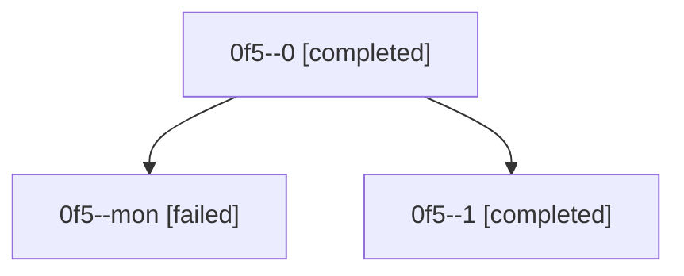

# Family: 0f5

[Agent Hoods](../README.md) / [bbugyi200](../users/bbugyi200/README.md) / [athena](../users/bbugyi200/machines/athena/README.md) / [0f5](../users/bbugyi200/machines/athena/hoods/0f5/README.md) / 0f5

Owner: `bbugyi200.athena` · Hood: `0f5` · Members: 3

## Lineage

The diagram is an optional enhancement; the ordered table below contains the same lineage in accessible text.

| Role | Agent | State | Model / provider | Timing | Commits | Prompt | Chat |
|---|---|---|---|---|---:|---|---|
| 0 | 0f5--0 | completed | gpt-5.5 / codex | 2026-08-27T18:25:08.389923+00:00 → 2026-08-27T19:40:35.351967+00:00 | 0 | [Prompt](../agents/bbugyi200.athena.0f5--0/prompt.md) | [Chat](../agents/bbugyi200.athena.0f5--0/chat.md) |
| mon | 0f5--mon | failed | gpt-5.5 / codex | 2026-08-27T19:39:59.348248+00:00 | 0 | — | [Chat](../agents/bbugyi200.athena.0f5--mon/chat.md) |
| 1 | 0f5--1 | completed | gpt-5.5 / codex | 2026-08-27T20:00:41.887632+00:00 → 2026-08-27T20:03:42.181958+00:00 | [1](../agents/bbugyi200.athena.0f5--1/README.md#commits) | [Prompt](../agents/bbugyi200.athena.0f5--1/prompt.md) | [Chat](../agents/bbugyi200.athena.0f5--1/chat.md) |

## Commits

| Role | Repo | Commit | Subject | Committed |
|---|---|---|---|---|
| 1 | sase | [`eeb257a`](https://github.com/sase-org/sase/commit/eeb257a804538f57d2afad4b7832a1ac26f46675) | fix(wait): resolve gate-shell wait dependencies | 2026-08-27 16:03:10 EDT |
