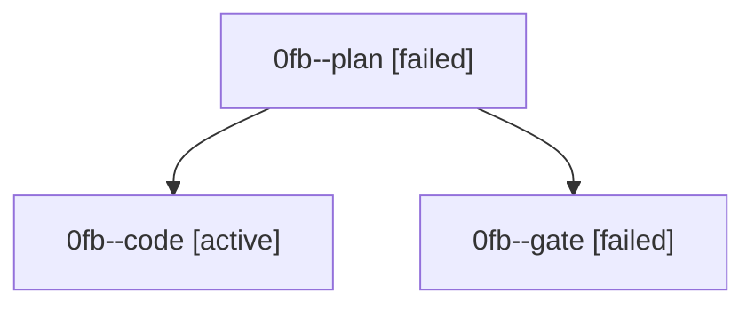

# Family: 0fb

[Agent Hoods](../README.md) / [bbugyi200](../users/bbugyi200/README.md) / [athena](../users/bbugyi200/machines/athena/README.md) / [0fb](../users/bbugyi200/machines/athena/hoods/0fb/README.md) / 0fb

Owner: `bbugyi200.athena` · Hood: `0fb` · Members: 3

## Lineage

The diagram is an optional enhancement; the ordered table below contains the same lineage in accessible text.

| Role | Agent | State | Model / provider | Timing | Commits | Prompt | Chat |
|---|---|---|---|---|---:|---|---|
| plan | 0fb--plan | failed | opus / claude | 2026-08-27T23:16:54.361439+00:00 → 2026-08-27T23:30:50.125983+00:00 | 0 | [Prompt](../agents/bbugyi200.athena.0fb--plan/prompt.md) | [Chat](../agents/bbugyi200.athena.0fb--plan/chat.md) |
| code | 0fb--code | active | gpt-5.5 / codex | 2026-08-27T23:32:57.313794+00:00 | [1](../agents/bbugyi200.athena.0fb--code/README.md#commits) | [Prompt](../agents/bbugyi200.athena.0fb--code/prompt.md) | — |
| gate | 0fb--gate | failed | opus / claude | 2026-08-27T23:30:49.377580+00:00 → 2026-08-27T23:32:51.136412+00:00 | 0 | — | [Chat](../agents/bbugyi200.athena.0fb--gate/chat.md) |

## Commits

| Role | Repo | Commit | Subject | Committed |
|---|---|---|---|---|
| code | sase | [`6308174`](https://github.com/sase-org/sase/commit/630817489aec8f2230109101de4532a3062e70fe) | fix(gate): treat gate handoffs as successful shell handoffs | 2026-08-27 20:07:22 EDT |
