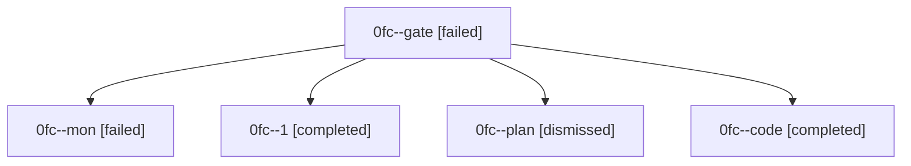

# Family: 0fc

[Agent Hoods](../README.md) / [bbugyi200](../users/bbugyi200/README.md) / [athena](../users/bbugyi200/machines/athena/README.md) / [0fc](../users/bbugyi200/machines/athena/hoods/0fc/README.md) / 0fc

Owner: `bbugyi200.athena` · Hood: `0fc` · Members: 5

## Lineage

The diagram is an optional enhancement; the ordered table below contains the same lineage in accessible text.

| Role | Agent | State | Model / provider | Timing | Commits | Prompt | Chat |
|---|---|---|---|---|---:|---|---|
| gate | 0fc--gate | failed | opus / claude | 2026-08-28T10:53:26.185079+00:00 → 2026-08-28T10:57:51.180244+00:00 | 0 | — | [Chat](../agents/bbugyi200.athena.0fc--gate/chat.md) |
| mon | 0fc--mon | failed | gpt-5.5 / codex | 2026-08-28T11:25:27.272588+00:00 | 0 | — | [Chat](../agents/bbugyi200.athena.0fc--mon/chat.md) |
| 1 | 0fc--1 | completed | gpt-5.5 / codex | 2026-08-28T11:54:58.214082+00:00 → 2026-08-28T12:05:48.393211+00:00 | [1](../agents/bbugyi200.athena.0fc--1/README.md#commits) | [Prompt](../agents/bbugyi200.athena.0fc--1/prompt.md) | [Chat](../agents/bbugyi200.athena.0fc--1/chat.md) |
| plan | 0fc--plan | dismissed | — | 2026-08-28T06:48:02 | 0 | — | — |
| code | 0fc--code | completed | gpt-5.5 / codex | 2026-08-28T10:57:57.343413+00:00 → 2026-08-28T11:25:37.622651+00:00 | 0 | [Prompt](../agents/bbugyi200.athena.0fc--code/prompt.md) | [Chat](../agents/bbugyi200.athena.0fc--code/chat.md) |

## Commits

| Role | Repo | Commit | Subject | Committed |
|---|---|---|---|---|
| 1 | sase | [`d929ed8`](https://github.com/sase-org/sase/commit/d929ed82bd1b698d4bd010bb8147cc98c459e519) | test(selection): record current flake baseline debt | 2026-08-28 08:05:06 EDT |
