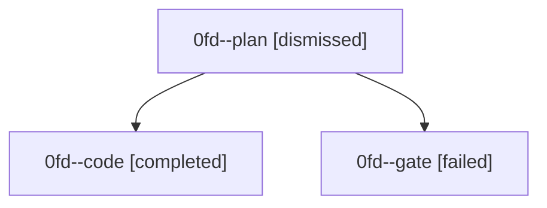

# Family: 0fd

[Agent Hoods](../README.md) / [bbugyi200](../users/bbugyi200/README.md) / [athena](../users/bbugyi200/machines/athena/README.md) / [0fd](../users/bbugyi200/machines/athena/hoods/0fd/README.md) / 0fd

Owner: `bbugyi200.athena` · Hood: `0fd` · Members: 3

## Lineage

The diagram is an optional enhancement; the ordered table below contains the same lineage in accessible text.

| Role | Agent | State | Model / provider | Timing | Commits | Prompt | Chat |
|---|---|---|---|---|---:|---|---|
| plan | 0fd--plan | dismissed | — | 2026-08-28T06:50:27 | 0 | — | — |
| code | 0fd--code | completed | gpt-5.5 / codex | 2026-08-28T11:00:18.439233+00:00 → 2026-08-28T11:37:32.449671+00:00 | [1](../agents/bbugyi200.athena.0fd--code/README.md#commits) | [Prompt](../agents/bbugyi200.athena.0fd--code/prompt.md) | [Chat](../agents/bbugyi200.athena.0fd--code/chat.md) |
| gate | 0fd--gate | failed | gpt-5.6-sol / codex | 2026-08-28T10:56:03.672804+00:00 → 2026-08-28T11:00:11.033321+00:00 | 0 | — | [Chat](../agents/bbugyi200.athena.0fd--gate/chat.md) |

## Commits

| Role | Repo | Commit | Subject | Committed |
|---|---|---|---|---|
| code | sase | [`65e0974`](https://github.com/sase-org/sase/commit/65e09744a0180e86a21574be01dfc6882d90b969) | fix(pager): bound hint capsule styles | 2026-08-28 07:22:48 EDT |
