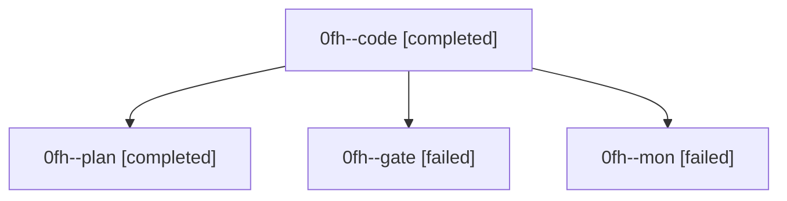

# Family: 0fh

[Agent Hoods](../README.md) / [bbugyi200](../users/bbugyi200/README.md) / [athena](../users/bbugyi200/machines/athena/README.md) / [0fh](../users/bbugyi200/machines/athena/hoods/0fh/README.md) / 0fh

Owner: `bbugyi200.athena` · Hood: `0fh` · Members: 4

## Lineage

The diagram is an optional enhancement; the ordered table below contains the same lineage in accessible text.

| Role | Agent | State | Model / provider | Timing | Commits | Prompt | Chat |
|---|---|---|---|---|---:|---|---|
| code | 0fh--code | completed | gpt-5.5 / codex | 2026-08-28T13:55:50.482848+00:00 → 2026-08-28T15:20:06.134552+00:00 | [1](../agents/bbugyi200.athena.0fh--code/README.md#commits) | [Prompt](../agents/bbugyi200.athena.0fh--code/prompt.md) | [Chat](../agents/bbugyi200.athena.0fh--code/chat.md) |
| plan | 0fh--plan | completed | opus / claude | 2026-08-28T13:43:43.980205+00:00 → 2026-08-28T13:54:05.268962+00:00 | 0 | [Prompt](../agents/bbugyi200.athena.0fh--plan/prompt.md) | [Chat](../agents/bbugyi200.athena.0fh--plan/chat.md) |
| gate | 0fh--gate | failed | opus / claude | 2026-08-28T13:53:29.739503+00:00 → 2026-08-28T13:55:43.938716+00:00 | 0 | — | [Chat](../agents/bbugyi200.athena.0fh--gate/chat.md) |
| mon | 0fh--mon | failed | gpt-5.5 / codex | 2026-08-28T14:44:58.532938+00:00 | 0 | — | — |

## Commits

| Role | Repo | Commit | Subject | Committed |
|---|---|---|---|---|
| code | sase | [`8e32b47`](https://github.com/sase-org/sase/commit/8e32b47b36f7e0c9da1d76f7760f57d28d3f69d9) | feat(bead): route show across enabled projects | 2026-08-28 11:17:29 EDT |
