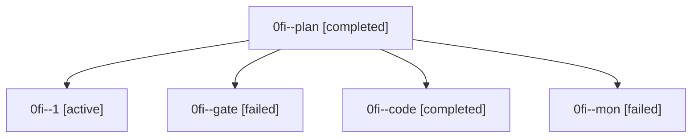

# Family: 0fi

[Agent Hoods](../README.md) / [bbugyi200](../users/bbugyi200/README.md) / [athena](../users/bbugyi200/machines/athena/README.md) / [0fi](../users/bbugyi200/machines/athena/hoods/0fi/README.md) / 0fi

Owner: `bbugyi200.athena` · Hood: `0fi` · Members: 5

## Lineage

The diagram is an optional enhancement; the ordered table below contains the same lineage in accessible text.

| Role | Agent | State | Model / provider | Timing | Commits | Prompt | Chat |
|---|---|---|---|---|---:|---|---|
| plan | 0fi--plan | completed | opus / claude | 2026-08-28T13:47:34.058845+00:00 → 2026-08-28T13:58:38.378281+00:00 | 0 | [Prompt](../agents/bbugyi200.athena.0fi--plan/prompt.md) | [Chat](../agents/bbugyi200.athena.0fi--plan/chat.md) |
| 1 | 0fi--1 | active | grok-4.6 / grok | 2026-08-28T15:20:02.655421+00:00 | [1](../agents/bbugyi200.athena.0fi--1/README.md#commits) | [Prompt](../agents/bbugyi200.athena.0fi--1/prompt.md) | — |
| gate | 0fi--gate | failed | opus / claude | 2026-08-28T13:58:26.368334+00:00 → 2026-08-28T14:10:16.117734+00:00 | 0 | — | [Chat](../agents/bbugyi200.athena.0fi--gate/chat.md) |
| code | 0fi--code | completed | grok-4.6 / grok | 2026-08-28T14:10:22.577213+00:00 → 2026-08-28T14:54:25.789321+00:00 | 0 | [Prompt](../agents/bbugyi200.athena.0fi--code/prompt.md) | [Chat](../agents/bbugyi200.athena.0fi--code/chat.md) |
| mon | 0fi--mon | failed | grok-4.6 / grok | 2026-08-28T14:54:16.361313+00:00 | 0 | — | [Chat](../agents/bbugyi200.athena.0fi--mon/chat.md) |

## Commits

| Role | Repo | Commit | Subject | Committed |
|---|---|---|---|---|
| 1 | sase | [`06a260d`](https://github.com/sase-org/sase/commit/06a260d2c07570d48f212b24fc3310adfc39ad67) | fix(axe): emit a structured gate\_shell\_reclaim chop result | 2026-08-28 11:41:53 EDT |
