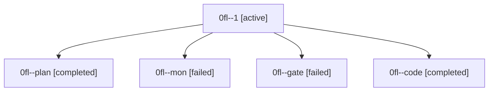

# Family: 0fl

[Agent Hoods](../README.md) / [bbugyi200](../users/bbugyi200/README.md) / [athena](../users/bbugyi200/machines/athena/README.md) / [0fl](../users/bbugyi200/machines/athena/hoods/0fl/README.md) / 0fl

Owner: `bbugyi200.athena` · Hood: `0fl` · Members: 5

## Lineage

The diagram is an optional enhancement; the ordered table below contains the same lineage in accessible text.

| Role | Agent | State | Model / provider | Timing | Commits | Prompt | Chat |
|---|---|---|---|---|---:|---|---|
| 1 | 0fl--1 | active | grok-4.6 / grok | 2026-08-28T17:51:23.492476+00:00 | [1](../agents/bbugyi200.athena.0fl--1/README.md#commits) | [Prompt](../agents/bbugyi200.athena.0fl--1/prompt.md) | — |
| plan | 0fl--plan | completed | opus / claude | 2026-08-28T16:31:05.593233+00:00 → 2026-08-28T16:44:11.282200+00:00 | 0 | [Prompt](../agents/bbugyi200.athena.0fl--plan/prompt.md) | [Chat](../agents/bbugyi200.athena.0fl--plan/chat.md) |
| mon | 0fl--mon | failed | grok-4.6 / grok | 2026-08-28T17:11:24.157359+00:00 | 0 | — | [Chat](../agents/bbugyi200.athena.0fl--mon/chat.md) |
| gate | 0fl--gate | failed | opus / claude | 2026-08-28T16:44:04.015264+00:00 → 2026-08-28T16:45:23.395659+00:00 | 0 | — | [Chat](../agents/bbugyi200.athena.0fl--gate/chat.md) |
| code | 0fl--code | completed | grok-4.6 / grok | 2026-08-28T16:45:29.342203+00:00 → 2026-08-28T17:11:31.956579+00:00 | 0 | [Prompt](../agents/bbugyi200.athena.0fl--code/prompt.md) | [Chat](../agents/bbugyi200.athena.0fl--code/chat.md) |

## Commits

| Role | Repo | Commit | Subject | Committed |
|---|---|---|---|---|
| 1 | sase | [`dde1b22`](https://github.com/sase-org/sase/commit/dde1b22d843f9a218c950b4141d9d68cca5b3269) | fix(ace): keep live ace-run shards in the artifact watcher | 2026-08-28 14:17:52 EDT |
