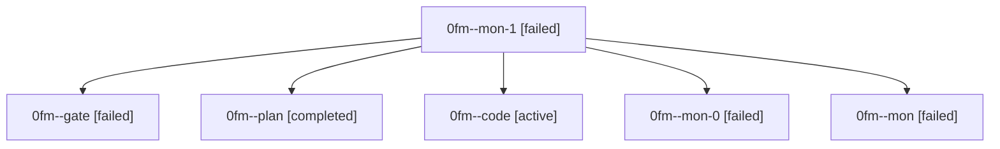

# Family: 0fm

[Agent Hoods](../README.md) / [bbugyi200](../users/bbugyi200/README.md) / [athena](../users/bbugyi200/machines/athena/README.md) / [0fm](../users/bbugyi200/machines/athena/hoods/0fm/README.md) / 0fm

Owner: `bbugyi200.athena` · Hood: `0fm` · Members: 6

## Lineage

The diagram is an optional enhancement; the ordered table below contains the same lineage in accessible text.

| Role | Agent | State | Model / provider | Timing | Commits | Prompt | Chat |
|---|---|---|---|---|---:|---|---|
| mon-1 | 0fm--mon-1 | failed | gpt-5.5 / codex | 2026-08-28T17:29:07.483199+00:00 | 0 | — | — |
| gate | 0fm--gate | failed | opus / claude | 2026-08-28T17:09:51.970187+00:00 → 2026-08-28T17:13:57.505806+00:00 | 0 | — | [Chat](../agents/bbugyi200.athena.0fm--gate/chat.md) |
| plan | 0fm--plan | completed | opus / claude | 2026-08-28T17:01:44.501359+00:00 → 2026-08-28T17:09:58.891131+00:00 | 0 | [Prompt](../agents/bbugyi200.athena.0fm--plan/prompt.md) | [Chat](../agents/bbugyi200.athena.0fm--plan/chat.md) |
| code | 0fm--code | active | gpt-5.5 / codex | 2026-08-28T17:14:03.432266+00:00 | [1](../agents/bbugyi200.athena.0fm--code/README.md#commits) | [Prompt](../agents/bbugyi200.athena.0fm--code/prompt.md) | — |
| mon-0 | 0fm--mon-0 | failed | gpt-5.5 / codex | 2026-08-28T17:28:30.435545+00:00 | 0 | — | — |
| mon | 0fm--mon | failed | gpt-5.5 / codex | 2026-08-28T17:27:43.503270+00:00 | 0 | — | — |

## Commits

| Role | Repo | Commit | Subject | Committed |
|---|---|---|---|---|
| code | sase | [`70e2d52`](https://github.com/sase-org/sase/commit/70e2d5250765cbae1fdb892ee6bc00d7aed20199) | fix(task-types): require one plus-one for bug triage | 2026-08-28 13:51:00 EDT |
