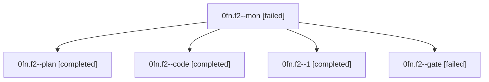

# Family: 0fn.f2

[Agent Hoods](../README.md) / [bbugyi200](../users/bbugyi200/README.md) / [athena](../users/bbugyi200/machines/athena/README.md) / [0fn](../users/bbugyi200/machines/athena/hoods/0fn/README.md) / 0fn.f2

Owner: `bbugyi200.athena` · Hood: `0fn` · Members: 5

## Lineage

The diagram is an optional enhancement; the ordered table below contains the same lineage in accessible text.

| Role | Agent | State | Model / provider | Timing | Commits | Prompt | Chat |
|---|---|---|---|---|---:|---|---|
| mon | 0fn.f2--mon | failed | grok-4.6 / grok | 2026-08-28T19:14:52.402787+00:00 | 0 | — | [Chat](../agents/bbugyi200.athena.0fn.f2--mon/chat.md) |
| plan | 0fn.f2--plan | completed | opus / claude | 2026-08-28T18:25:25.889475+00:00 → 2026-08-28T18:40:23.975442+00:00 | 0 | [Prompt](../agents/bbugyi200.athena.0fn.f2--plan/prompt.md) | [Chat](../agents/bbugyi200.athena.0fn.f2--plan/chat.md) |
| code | 0fn.f2--code | completed | grok-4.6 / grok | 2026-08-28T18:41:29.119446+00:00 → 2026-08-28T19:15:00.457841+00:00 | 0 | [Prompt](../agents/bbugyi200.athena.0fn.f2--code/prompt.md) | [Chat](../agents/bbugyi200.athena.0fn.f2--code/chat.md) |
| 1 | 0fn.f2--1 | completed | grok-4.6 / grok | 2026-08-28T19:18:01.555607+00:00 → 2026-08-28T20:05:20.323781+00:00 | [1](../agents/bbugyi200.athena.0fn.f2--1/README.md#commits) | [Prompt](../agents/bbugyi200.athena.0fn.f2--1/prompt.md) | [Chat](../agents/bbugyi200.athena.0fn.f2--1/chat.md) |
| gate | 0fn.f2--gate | failed | opus / claude | 2026-08-28T18:40:15.212388+00:00 → 2026-08-28T18:41:23.004930+00:00 | 0 | — | [Chat](../agents/bbugyi200.athena.0fn.f2--gate/chat.md) |

## Commits

| Role | Repo | Commit | Subject | Committed |
|---|---|---|---|---|
| 1 | sase | [`965aa5c`](https://github.com/sase-org/sase/commit/965aa5c5ec24921f35cc019842a415b94dbc0bdd) | fix(ace): stamp finished\_at on settled monitor nodes | 2026-08-28 16:04:03 EDT |

## Neighbors

| Agent | Relation | State |
|---|---|---|
| [0fn](bbugyi200.athena.0fn.md) (family · 3) | ancestor | completed 2, failed 1 |
| [0fn.f0](../agents/bbugyi200.athena.0fn.f0/README.md) | 0fn hood | active |
