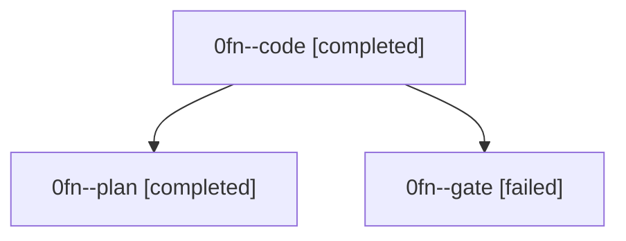

# Family: 0fn

[Agent Hoods](../README.md) / [bbugyi200](../users/bbugyi200/README.md) / [athena](../users/bbugyi200/machines/athena/README.md) / [0fn](../users/bbugyi200/machines/athena/hoods/0fn/README.md) / 0fn

Owner: `bbugyi200.athena` · Hood: `0fn` · Members: 3

## Lineage

The diagram is an optional enhancement; the ordered table below contains the same lineage in accessible text.

| Role | Agent | State | Model / provider | Timing | Commits | Prompt | Chat |
|---|---|---|---|---|---:|---|---|
| code | 0fn--code | completed | gpt-5.5 / codex | 2026-08-28T18:04:10.418956+00:00 → 2026-08-28T18:25:10.218658+00:00 | [1](../agents/bbugyi200.athena.0fn--code/README.md#commits) | [Prompt](../agents/bbugyi200.athena.0fn--code/prompt.md) | [Chat](../agents/bbugyi200.athena.0fn--code/chat.md) |
| plan | 0fn--plan | completed | opus / claude | 2026-08-28T17:51:25.131522+00:00 → 2026-08-28T18:01:57.439598+00:00 | 0 | [Prompt](../agents/bbugyi200.athena.0fn--plan/prompt.md) | [Chat](../agents/bbugyi200.athena.0fn--plan/chat.md) |
| gate | 0fn--gate | failed | opus / claude | 2026-08-28T18:01:49.364059+00:00 → 2026-08-28T18:04:04.236420+00:00 | 0 | — | [Chat](../agents/bbugyi200.athena.0fn--gate/chat.md) |

## Commits

| Role | Repo | Commit | Subject | Committed |
|---|---|---|---|---|
| code | sase | [`98707c0`](https://github.com/sase-org/sase/commit/98707c02b9271e5a01ee2603b60e1d90c35981a0) | fix(wait-deps): resolve self-family fork waits | 2026-08-28 14:23:01 EDT |

## Neighbors

| Agent | Relation | State |
|---|---|---|
| [0fn.f0](../agents/bbugyi200.athena.0fn.f0/README.md) | descendant | active |
| [0fn.f2](bbugyi200.athena.0fn.f2.md) (family · 5) | descendant | completed 3, failed 2 |
