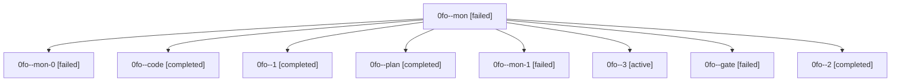

# Family: 0fo

[Agent Hoods](../README.md) / [bbugyi200](../users/bbugyi200/README.md) / [athena](../users/bbugyi200/machines/athena/README.md) / [0fo](../users/bbugyi200/machines/athena/hoods/0fo/README.md) / 0fo

Owner: `bbugyi200.athena` · Hood: `0fo` · Members: 9

## Lineage

The diagram is an optional enhancement; the ordered table below contains the same lineage in accessible text.

| Role | Agent | State | Model / provider | Timing | Commits | Prompt | Chat |
|---|---|---|---|---|---:|---|---|
| mon | 0fo--mon | failed | grok-4.6 / grok | 2026-08-28T18:22:07.712035+00:00 | 0 | — | [Chat](../agents/bbugyi200.athena.0fo--mon/chat.md) |
| mon-0 | 0fo--mon-0 | failed | grok-4.6 / grok | 2026-08-28T18:45:21.745052+00:00 | 0 | — | [Chat](../agents/bbugyi200.athena.0fo--mon-0/chat.md) |
| code | 0fo--code | completed | grok-4.6 / grok | 2026-08-28T18:17:01.123490+00:00 → 2026-08-28T18:22:15.943227+00:00 | 0 | [Prompt](../agents/bbugyi200.athena.0fo--code/prompt.md) | [Chat](../agents/bbugyi200.athena.0fo--code/chat.md) |
| 1 | 0fo--1 | completed | grok-4.6 / grok | 2026-08-28T18:32:39.176930+00:00 → 2026-08-28T18:45:33.086883+00:00 | 0 | [Prompt](../agents/bbugyi200.athena.0fo--1/prompt.md) | [Chat](../agents/bbugyi200.athena.0fo--1/chat.md) |
| plan | 0fo--plan | completed | opus / claude | 2026-08-28T18:09:15.262506+00:00 → 2026-08-28T18:14:57.408168+00:00 | 0 | [Prompt](../agents/bbugyi200.athena.0fo--plan/prompt.md) | [Chat](../agents/bbugyi200.athena.0fo--plan/chat.md) |
| mon-1 | 0fo--mon-1 | failed | grok-4.6 / grok | 2026-08-28T18:59:04.408597+00:00 | 0 | — | [Chat](../agents/bbugyi200.athena.0fo--mon-1/chat.md) |
| 3 | 0fo--3 | active | grok-4.6 / grok | 2026-08-28T19:08:52.566685+00:00 | 0 | [Prompt](../agents/bbugyi200.athena.0fo--3/prompt.md) | — |
| gate | 0fo--gate | failed | opus / claude | 2026-08-28T18:14:50.290417+00:00 → 2026-08-28T18:16:54.853387+00:00 | 0 | — | [Chat](../agents/bbugyi200.athena.0fo--gate/chat.md) |
| 2 | 0fo--2 | completed | grok-4.6 / grok | 2026-08-28T18:55:19.561185+00:00 → 2026-08-28T18:59:16.592655+00:00 | 0 | [Prompt](../agents/bbugyi200.athena.0fo--2/prompt.md) | [Chat](../agents/bbugyi200.athena.0fo--2/chat.md) |
