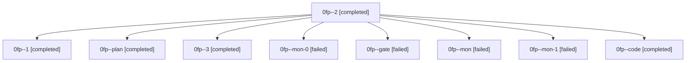

# Family: 0fp

[Agent Hoods](../README.md) / [bbugyi200](../users/bbugyi200/README.md) / [athena](../users/bbugyi200/machines/athena/README.md) / [0fp](../users/bbugyi200/machines/athena/hoods/0fp/README.md) / 0fp

Owner: `bbugyi200.athena` · Hood: `0fp` · Members: 9

## Lineage

The diagram is an optional enhancement; the ordered table below contains the same lineage in accessible text.

| Role | Agent | State | Model / provider | Timing | Commits | Prompt | Chat |
|---|---|---|---|---|---:|---|---|
| 2 | 0fp--2 | completed | grok-4.6 / grok | 2026-08-28T20:07:24.221005+00:00 → 2026-08-28T20:20:36.480627+00:00 | 0 | [Prompt](../agents/bbugyi200.athena.0fp--2/prompt.md) | [Chat](../agents/bbugyi200.athena.0fp--2/chat.md) |
| 1 | 0fp--1 | completed | grok-4.6 / grok | 2026-08-28T19:39:33.871139+00:00 → 2026-08-28T19:47:07.869561+00:00 | 0 | [Prompt](../agents/bbugyi200.athena.0fp--1/prompt.md) | [Chat](../agents/bbugyi200.athena.0fp--1/chat.md) |
| plan | 0fp--plan | completed | opus / claude | 2026-08-28T18:30:18.556667+00:00 → 2026-08-28T18:51:59.674516+00:00 | 0 | [Prompt](../agents/bbugyi200.athena.0fp--plan/prompt.md) | [Chat](../agents/bbugyi200.athena.0fp--plan/chat.md) |
| 3 | 0fp--3 | completed | grok-4.6 / grok | 2026-08-28T20:46:19.015266+00:00 → 2026-08-28T21:03:13.377535+00:00 | 0 | [Prompt](../agents/bbugyi200.athena.0fp--3/prompt.md) | [Chat](../agents/bbugyi200.athena.0fp--3/chat.md) |
| mon-0 | 0fp--mon-0 | failed | grok-4.6 / grok | 2026-08-28T19:46:42.811898+00:00 | 0 | — | [Chat](../agents/bbugyi200.athena.0fp--mon-0/chat.md) |
| gate | 0fp--gate | failed | opus / claude | 2026-08-28T18:51:51.332885+00:00 → 2026-08-28T18:52:57.718375+00:00 | 0 | — | [Chat](../agents/bbugyi200.athena.0fp--gate/chat.md) |
| mon | 0fp--mon | failed | grok-4.6 / grok | 2026-08-28T19:36:28.643970+00:00 | 0 | — | [Chat](../agents/bbugyi200.athena.0fp--mon/chat.md) |
| mon-1 | 0fp--mon-1 | failed | grok-4.6 / grok | 2026-08-28T20:20:25.487189+00:00 → 2026-08-28T20:45:54.983489+00:00 | 0 | — | [Chat](../agents/bbugyi200.athena.0fp--mon-1/chat.md) |
| code | 0fp--code | completed | grok-4.6 / grok | 2026-08-28T18:53:03.765701+00:00 → 2026-08-28T19:36:36.935159+00:00 | 0 | [Prompt](../agents/bbugyi200.athena.0fp--code/prompt.md) | [Chat](../agents/bbugyi200.athena.0fp--code/chat.md) |
