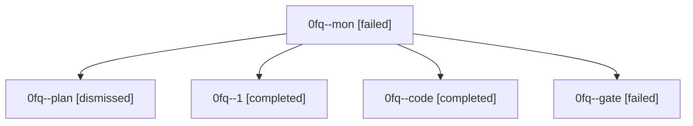

# Family: 0fq

[Agent Hoods](../README.md) / [bbugyi200](../users/bbugyi200/README.md) / [athena](../users/bbugyi200/machines/athena/README.md) / [0fq](../users/bbugyi200/machines/athena/hoods/0fq/README.md) / 0fq

Owner: `bbugyi200.athena` · Hood: `0fq` · Members: 5

## Lineage

The diagram is an optional enhancement; the ordered table below contains the same lineage in accessible text.

| Role | Agent | State | Model / provider | Timing | Commits | Prompt | Chat |
|---|---|---|---|---|---:|---|---|
| mon | 0fq--mon | failed | grok-4.6 / grok | 2026-08-28T21:20:34.552132+00:00 → 2026-08-28T21:26:12.335368+00:00 | 0 | — | [Chat](../agents/bbugyi200.athena.0fq--mon/chat.md) |
| plan | 0fq--plan | dismissed | — | 2026-08-28T16:45:22 | 0 | — | — |
| 1 | 0fq--1 | completed | grok-4.6 / grok | 2026-08-28T21:26:28.868983+00:00 → 2026-08-28T21:51:36.944774+00:00 | [1](../agents/bbugyi200.athena.0fq--1/README.md#commits) | [Prompt](../agents/bbugyi200.athena.0fq--1/prompt.md) | [Chat](../agents/bbugyi200.athena.0fq--1/chat.md) |
| code | 0fq--code | completed | grok-4.6 / grok | 2026-08-28T20:58:37.820964+00:00 → 2026-08-28T21:20:42.192746+00:00 | 0 | [Prompt](../agents/bbugyi200.athena.0fq--code/prompt.md) | [Chat](../agents/bbugyi200.athena.0fq--code/chat.md) |
| gate | 0fq--gate | failed | opus / claude | 2026-08-28T20:56:55.881396+00:00 → 2026-08-28T20:58:31.896159+00:00 | 0 | — | [Chat](../agents/bbugyi200.athena.0fq--gate/chat.md) |

## Commits

| Role | Repo | Commit | Subject | Committed |
|---|---|---|---|---|
| 1 | sase | [`affc43a`](https://github.com/sase-org/sase/commit/affc43a6fef74e33c1c3edfb6cc51b5a978e20af) | docs(memory): apply AGENTS v2 #a annotation trims | 2026-08-28 17:48:54 EDT |
