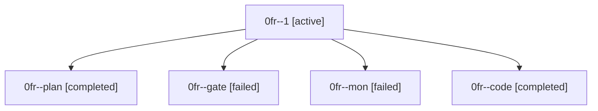

# Family: 0fr

[Agent Hoods](../README.md) / [bbugyi200](../users/bbugyi200/README.md) / [athena](../users/bbugyi200/machines/athena/README.md) / [0fr](../users/bbugyi200/machines/athena/hoods/0fr/README.md) / 0fr

Owner: `bbugyi200.athena` · Hood: `0fr` · Members: 5

## Lineage

The diagram is an optional enhancement; the ordered table below contains the same lineage in accessible text.

| Role | Agent | State | Model / provider | Timing | Commits | Prompt | Chat |
|---|---|---|---|---|---:|---|---|
| 1 | 0fr--1 | active | grok-4.6 / grok | 2026-08-28T22:00:24.484092+00:00 | [1](../agents/bbugyi200.athena.0fr--1/README.md#commits) | [Prompt](../agents/bbugyi200.athena.0fr--1/prompt.md) | — |
| plan | 0fr--plan | completed | opus / claude | 2026-08-28T20:54:05.140551+00:00 → 2026-08-28T21:09:20.150859+00:00 | 0 | [Prompt](../agents/bbugyi200.athena.0fr--plan/prompt.md) | [Chat](../agents/bbugyi200.athena.0fr--plan/chat.md) |
| gate | 0fr--gate | failed | opus / claude | 2026-08-28T21:09:12.737512+00:00 → 2026-08-28T21:10:19.198212+00:00 | 0 | — | [Chat](../agents/bbugyi200.athena.0fr--gate/chat.md) |
| mon | 0fr--mon | failed | grok-4.6 / grok | 2026-08-28T21:54:41.535886+00:00 → 2026-08-28T22:00:07.190891+00:00 | 0 | — | [Chat](../agents/bbugyi200.athena.0fr--mon/chat.md) |
| code | 0fr--code | completed | grok-4.6 / grok | 2026-08-28T21:10:25.429517+00:00 → 2026-08-28T21:54:49.996383+00:00 | 0 | [Prompt](../agents/bbugyi200.athena.0fr--code/prompt.md) | [Chat](../agents/bbugyi200.athena.0fr--code/chat.md) |

## Commits

| Role | Repo | Commit | Subject | Committed |
|---|---|---|---|---|
| 1 | sase | [`45a0a88`](https://github.com/sase-org/sase/commit/45a0a8880a4e0c7f55e15ca30959fe8f63b7fde3) | fix(ace): complete the Agents window prefix once after first paint | 2026-08-28 18:34:13 EDT |
