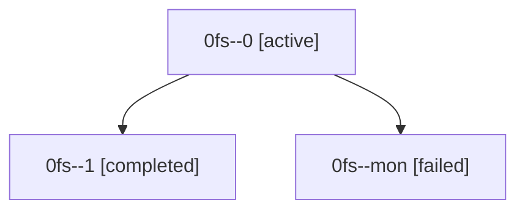

# Family: 0fs

[Agent Hoods](../README.md) / [bbugyi200](../users/bbugyi200/README.md) / [athena](../users/bbugyi200/machines/athena/README.md) / [0fs](../users/bbugyi200/machines/athena/hoods/0fs/README.md) / 0fs

Owner: `bbugyi200.athena` · Hood: `0fs` · Members: 3

## Lineage

The diagram is an optional enhancement; the ordered table below contains the same lineage in accessible text.

| Role | Agent | State | Model / provider | Timing | Commits | Prompt | Chat |
|---|---|---|---|---|---:|---|---|
| 0 | 0fs--0 | active | gpt-5.5 / codex | 2026-08-28T21:32:23.126297+00:00 | 0 | [Prompt](../agents/bbugyi200.athena.0fs--0/prompt.md) | [Chat](../agents/bbugyi200.athena.0fs--0/chat.md) |
| 1 | 0fs--1 | completed | gpt-5.5 / codex | 2026-08-28T22:14:59.747586+00:00 → 2026-08-28T22:33:45.775364+00:00 | 0 | [Prompt](../agents/bbugyi200.athena.0fs--1/prompt.md) | [Chat](../agents/bbugyi200.athena.0fs--1/chat.md) |
| mon | 0fs--mon | failed | gpt-5.5 / codex | 2026-08-28T21:56:23.139385+00:00 → 2026-08-28T22:14:44.085128+00:00 | 0 | — | [Chat](../agents/bbugyi200.athena.0fs--mon/chat.md) |

## Commits

| Role | Repo | Commit | Subject | Committed |
|---|---|---|---|---|
| — | sase | [`2a4c075`](https://github.com/sase-org/sase/commit/2a4c075375bc331320fd1b7ad596c5d612274a21) | docs(agents): align AGENTS v2 instruction annotations | 2026-08-28 18:30:24 EDT |
