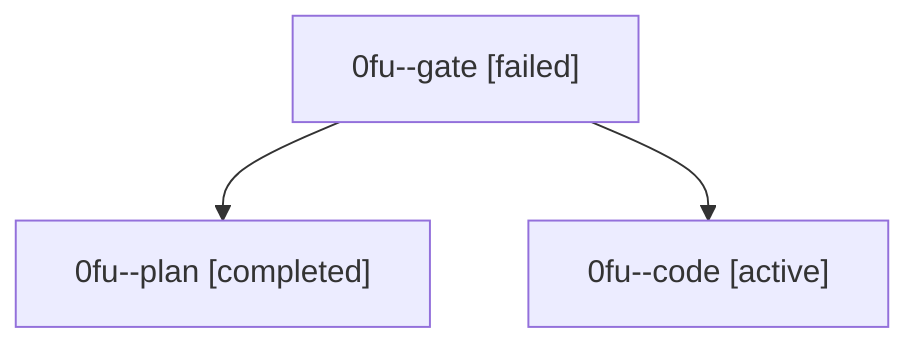

# Family: 0fu

[Agent Hoods](../README.md) / [bbugyi200](../users/bbugyi200/README.md) / [athena](../users/bbugyi200/machines/athena/README.md) / [0fu](../users/bbugyi200/machines/athena/hoods/0fu/README.md) / 0fu

Owner: `bbugyi200.athena` · Hood: `0fu` · Members: 3

## Lineage

The diagram is an optional enhancement; the ordered table below contains the same lineage in accessible text.

| Role | Agent | State | Model / provider | Timing | Commits | Prompt | Chat |
|---|---|---|---|---|---:|---|---|
| gate | 0fu--gate | failed | opus / claude | 2026-08-28T22:32:10.755283+00:00 → 2026-08-29T10:10:14.093459+00:00 | 0 | — | [Chat](../agents/bbugyi200.athena.0fu--gate/chat.md) |
| plan | 0fu--plan | completed | opus / claude | 2026-08-28T22:13:36.101667+00:00 → 2026-08-28T22:32:20.731283+00:00 | 0 | [Prompt](../agents/bbugyi200.athena.0fu--plan/prompt.md) | [Chat](../agents/bbugyi200.athena.0fu--plan/chat.md) |
| code | 0fu--code | active | grok-4.6 / grok | 2026-08-29T10:10:19.502680+00:00 | [1](../agents/bbugyi200.athena.0fu--code/README.md#commits) | [Prompt](../agents/bbugyi200.athena.0fu--code/prompt.md) | — |

## Commits

| Role | Repo | Commit | Subject | Committed |
|---|---|---|---|---|
| code | sase | [`72a96a8`](https://github.com/sase-org/sase/commit/72a96a801dbf8eeb6ee5b1459af94e9626ffb2ed) | fix(ace): keep pending gate shells visible in the Agents tab | 2026-08-29 06:52:23 EDT |
