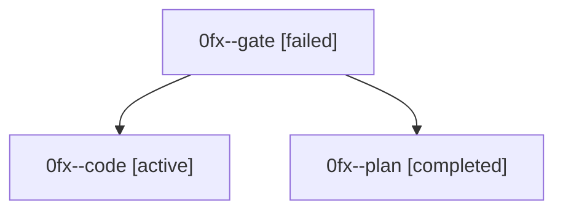

# Family: 0fx

[Agent Hoods](../README.md) / [bbugyi200](../users/bbugyi200/README.md) / [athena](../users/bbugyi200/machines/athena/README.md) / [0fx](../users/bbugyi200/machines/athena/hoods/0fx/README.md) / 0fx

Owner: `bbugyi200.athena` · Hood: `0fx` · Members: 3

## Lineage

The diagram is an optional enhancement; the ordered table below contains the same lineage in accessible text.

| Role | Agent | State | Model / provider | Timing | Commits | Prompt | Chat |
|---|---|---|---|---|---:|---|---|
| gate | 0fx--gate | failed | gpt-5.6-sol / codex | 2026-08-29T11:11:07.308433+00:00 → 2026-08-29T11:19:32.599173+00:00 | 0 | — | [Chat](../agents/bbugyi200.athena.0fx--gate/chat.md) |
| code | 0fx--code | active | grok-4.6 / grok | 2026-08-29T11:19:38.730205+00:00 | [1](../agents/bbugyi200.athena.0fx--code/README.md#commits) | [Prompt](../agents/bbugyi200.athena.0fx--code/prompt.md) | — |
| plan | 0fx--plan | completed | gpt-5.6-sol / codex | 2026-08-29T10:55:09.245996+00:00 → 2026-08-29T11:11:17.379960+00:00 | 0 | [Prompt](../agents/bbugyi200.athena.0fx--plan/prompt.md) | [Chat](../agents/bbugyi200.athena.0fx--plan/chat.md) |

## Commits

| Role | Repo | Commit | Subject | Committed |
|---|---|---|---|---|
| code | sase | [`2069fce`](https://github.com/sase-org/sase/commit/2069fcea0b78076ebfbf1cf071bdaecd0d8bc9e3) | feat(memory): delimit batch Markdown section headers | 2026-08-29 07:30:32 EDT |
