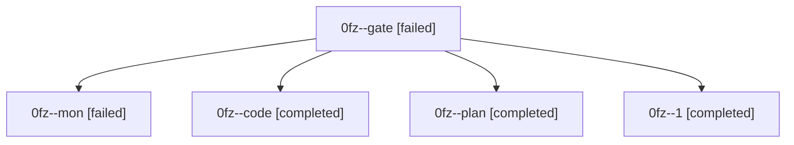

# Family: 0fz

[Agent Hoods](../README.md) / [bbugyi200](../users/bbugyi200/README.md) / [athena](../users/bbugyi200/machines/athena/README.md) / [0fz](../users/bbugyi200/machines/athena/hoods/0fz/README.md) / 0fz

Owner: `bbugyi200.athena` · Hood: `0fz` · Members: 5

## Lineage

The diagram is an optional enhancement; the ordered table below contains the same lineage in accessible text.

| Role | Agent | State | Model / provider | Timing | Commits | Prompt | Chat |
|---|---|---|---|---|---:|---|---|
| gate | 0fz--gate | failed | opus / claude | 2026-08-29T11:48:34.854504+00:00 → 2026-08-29T12:16:07.108100+00:00 | 0 | — | [Chat](../agents/bbugyi200.athena.0fz--gate/chat.md) |
| mon | 0fz--mon | failed | gpt-5.5 / codex | 2026-08-29T12:36:29.591135+00:00 → 2026-08-29T12:54:42.239756+00:00 | 0 | — | [Chat](../agents/bbugyi200.athena.0fz--mon/chat.md) |
| code | 0fz--code | completed | gpt-5.5 / codex | 2026-08-29T12:16:13.476631+00:00 → 2026-08-29T12:36:37.429000+00:00 | 0 | [Prompt](../agents/bbugyi200.athena.0fz--code/prompt.md) | [Chat](../agents/bbugyi200.athena.0fz--code/chat.md) |
| plan | 0fz--plan | completed | opus / claude | 2026-08-29T11:32:44.844752+00:00 → 2026-08-29T11:48:42.175561+00:00 | 0 | [Prompt](../agents/bbugyi200.athena.0fz--plan/prompt.md) | [Chat](../agents/bbugyi200.athena.0fz--plan/chat.md) |
| 1 | 0fz--1 | completed | gpt-5.5 / codex | 2026-08-29T12:55:01.085036+00:00 → 2026-08-29T12:56:47.504160+00:00 | [1](../agents/bbugyi200.athena.0fz--1/README.md#commits) | [Prompt](../agents/bbugyi200.athena.0fz--1/prompt.md) | [Chat](../agents/bbugyi200.athena.0fz--1/chat.md) |

## Commits

| Role | Repo | Commit | Subject | Committed |
|---|---|---|---|---|
| 1 | sase | [`17c465c`](https://github.com/sase-org/sase/commit/17c465c9d706219323d95e02bc3d8fb7ed09a76f) | fix(tui): keep nested agent rows in parent tribe | 2026-08-29 08:56:03 EDT |
