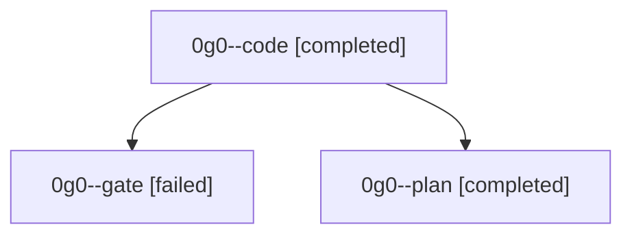

# Family: 0g0

[Agent Hoods](../README.md) / [bbugyi200](../users/bbugyi200/README.md) / [athena](../users/bbugyi200/machines/athena/README.md) / [0g0](../users/bbugyi200/machines/athena/hoods/0g0/README.md) / 0g0

Owner: `bbugyi200.athena` · Hood: `0g0` · Members: 3

## Lineage

The diagram is an optional enhancement; the ordered table below contains the same lineage in accessible text.

| Role | Agent | State | Model / provider | Timing | Commits | Prompt | Chat |
|---|---|---|---|---|---:|---|---|
| code | 0g0--code | completed | grok-4.6 / grok | 2026-08-29T12:38:17.556174+00:00 → 2026-08-29T13:03:08.352665+00:00 | [1](../agents/bbugyi200.athena.0g0--code/README.md#commits) | [Prompt](../agents/bbugyi200.athena.0g0--code/prompt.md) | [Chat](../agents/bbugyi200.athena.0g0--code/chat.md) |
| gate | 0g0--gate | failed | opus / claude | 2026-08-29T12:35:48.347474+00:00 → 2026-08-29T12:38:11.085349+00:00 | 0 | — | [Chat](../agents/bbugyi200.athena.0g0--gate/chat.md) |
| plan | 0g0--plan | completed | opus / claude | 2026-08-29T12:28:53.294966+00:00 → 2026-08-29T12:35:55.438195+00:00 | 0 | [Prompt](../agents/bbugyi200.athena.0g0--plan/prompt.md) | [Chat](../agents/bbugyi200.athena.0g0--plan/chat.md) |

## Commits

| Role | Repo | Commit | Subject | Committed |
|---|---|---|---|---|
| code | sase | [`80f389d`](https://github.com/sase-org/sase/commit/80f389d746baddabe1bb1fc800bce86f3b8dbbd7) | feat: add /sase\_memory\_write skill as the memory-edit gate | 2026-08-29 09:02:28 EDT |

## Neighbors

| Agent | Relation | State |
|---|---|---|
| [0g0.w0](bbugyi200.athena.0g0.w0.md) (family · 3) | descendant | active 1, completed 1, failed 1 |
