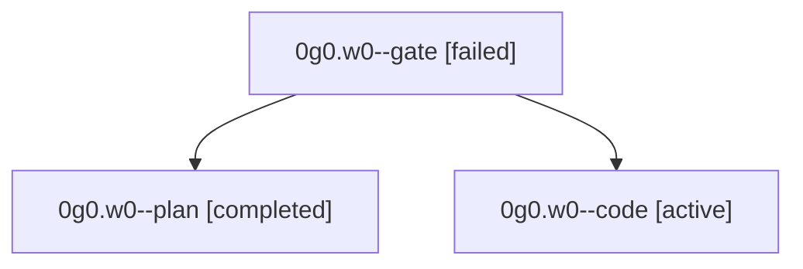

# Family: 0g0.w0

[Agent Hoods](../README.md) / [bbugyi200](../users/bbugyi200/README.md) / [athena](../users/bbugyi200/machines/athena/README.md) / [0g0](../users/bbugyi200/machines/athena/hoods/0g0/README.md) / 0g0.w0

Owner: `bbugyi200.athena` · Hood: `0g0` · Members: 3

## Lineage

The diagram is an optional enhancement; the ordered table below contains the same lineage in accessible text.

| Role | Agent | State | Model / provider | Timing | Commits | Prompt | Chat |
|---|---|---|---|---|---:|---|---|
| gate | 0g0.w0--gate | failed | opus / claude | 2026-08-29T13:09:13.798653+00:00 → 2026-08-29T13:20:00.496627+00:00 | 0 | — | [Chat](../agents/bbugyi200.athena.0g0.w0--gate/chat.md) |
| plan | 0g0.w0--plan | completed | opus / claude | 2026-08-29T13:03:25.631741+00:00 → 2026-08-29T13:09:20.674368+00:00 | 0 | [Prompt](../agents/bbugyi200.athena.0g0.w0--plan/prompt.md) | [Chat](../agents/bbugyi200.athena.0g0.w0--plan/chat.md) |
| code | 0g0.w0--code | active | grok-4.6 / grok | 2026-08-29T13:20:06.899923+00:00 | [1](../agents/bbugyi200.athena.0g0.w0--code/README.md#commits) | [Prompt](../agents/bbugyi200.athena.0g0.w0--code/prompt.md) | — |

## Commits

| Role | Repo | Commit | Subject | Committed |
|---|---|---|---|---|
| code | sase | [`9bc169e`](https://github.com/sase-org/sase/commit/9bc169e6cf0ff2ad2e1e31ebd15be4d1c21b80fb) | docs(memory): apply AGENTS v3 #b repository reminder annotations | 2026-08-29 09:35:54 EDT |

## Neighbors

| Agent | Relation | State |
|---|---|---|
| [0g0](bbugyi200.athena.0g0.md) (family · 3) | ancestor | completed 2, failed 1 |
