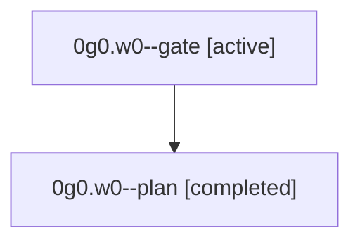

# Family: 0g0.w0

[Agent Hoods](../README.md) / [bbugyi200](../users/bbugyi200/README.md) / [athena](../users/bbugyi200/machines/athena/README.md) / [0g0](../users/bbugyi200/machines/athena/hoods/0g0/README.md) / 0g0.w0

Owner: `bbugyi200.athena` · Hood: `0g0` · Members: 2

## Lineage

The diagram is an optional enhancement; the ordered table below contains the same lineage in accessible text.

| Role | Agent | State | Model / provider | Timing | Commits | Prompt | Chat |
|---|---|---|---|---|---:|---|---|
| gate | 0g0.w0--gate | active | opus / claude | 2026-08-29T13:09:13.798653+00:00 | 0 | — | — |
| plan | 0g0.w0--plan | completed | opus / claude | 2026-08-29T13:03:25.631741+00:00 → 2026-08-29T13:09:20.674368+00:00 | 0 | [Prompt](../agents/bbugyi200.athena.0g0.w0--plan/prompt.md) | [Chat](../agents/bbugyi200.athena.0g0.w0--plan/chat.md) |

## Neighbors

| Agent | Relation | State |
|---|---|---|
| [0g0](bbugyi200.athena.0g0.md) (family · 3) | ancestor | completed 2, failed 1 |
