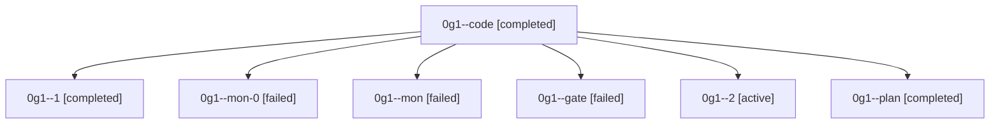

# Family: 0g1

[Agent Hoods](../README.md) / [bbugyi200](../users/bbugyi200/README.md) / [athena](../users/bbugyi200/machines/athena/README.md) / [0g1](../users/bbugyi200/machines/athena/hoods/0g1/README.md) / 0g1

Owner: `bbugyi200.athena` · Hood: `0g1` · Members: 7

## Lineage

The diagram is an optional enhancement; the ordered table below contains the same lineage in accessible text.

| Role | Agent | State | Model / provider | Timing | Commits | Prompt | Chat |
|---|---|---|---|---|---:|---|---|
| code | 0g1--code | completed | grok-4.6 / grok | 2026-08-29T13:19:45.961026+00:00 → 2026-08-29T13:54:43.943209+00:00 | 0 | [Prompt](../agents/bbugyi200.athena.0g1--code/prompt.md) | [Chat](../agents/bbugyi200.athena.0g1--code/chat.md) |
| 1 | 0g1--1 | completed | grok-4.6 / grok | 2026-08-29T13:58:31.882612+00:00 → 2026-08-29T14:13:35.328114+00:00 | 0 | [Prompt](../agents/bbugyi200.athena.0g1--1/prompt.md) | [Chat](../agents/bbugyi200.athena.0g1--1/chat.md) |
| mon-0 | 0g1--mon-0 | failed | grok-4.6 / grok | 2026-08-29T14:13:16.882410+00:00 → 2026-08-29T14:15:59.641325+00:00 | 0 | — | [Chat](../agents/bbugyi200.athena.0g1--mon-0/chat.md) |
| mon | 0g1--mon | failed | grok-4.6 / grok | 2026-08-29T13:54:07.217340+00:00 → 2026-08-29T13:58:14.496465+00:00 | 0 | — | [Chat](../agents/bbugyi200.athena.0g1--mon/chat.md) |
| gate | 0g1--gate | failed | opus / claude | 2026-08-29T13:00:31.765032+00:00 → 2026-08-29T13:19:46.631406+00:00 | 0 | — | [Chat](../agents/bbugyi200.athena.0g1--gate/chat.md) |
| 2 | 0g1--2 | active | grok-4.6 / grok | 2026-08-29T14:16:17.101161+00:00 | [1](../agents/bbugyi200.athena.0g1--2/README.md#commits) | [Prompt](../agents/bbugyi200.athena.0g1--2/prompt.md) | — |
| plan | 0g1--plan | completed | opus / claude | 2026-08-29T12:44:32.477830+00:00 → 2026-08-29T13:00:38.713241+00:00 | 0 | [Prompt](../agents/bbugyi200.athena.0g1--plan/prompt.md) | [Chat](../agents/bbugyi200.athena.0g1--plan/chat.md) |

## Commits

| Role | Repo | Commit | Subject | Committed |
|---|---|---|---|---|
| 2 | sase | [`fbd37ca`](https://github.com/sase-org/sase/commit/fbd37ca3da3b262fa310daec15a0fed45489e017) | fix(tui): exclude gate-shell windows from family and clan runtime | 2026-08-29 10:20:56 EDT |

## Neighbors

| Agent | Relation | State |
|---|---|---|
| [0g1.w0](../agents/bbugyi200.athena.0g1.w0/README.md) | descendant | dismissed |
