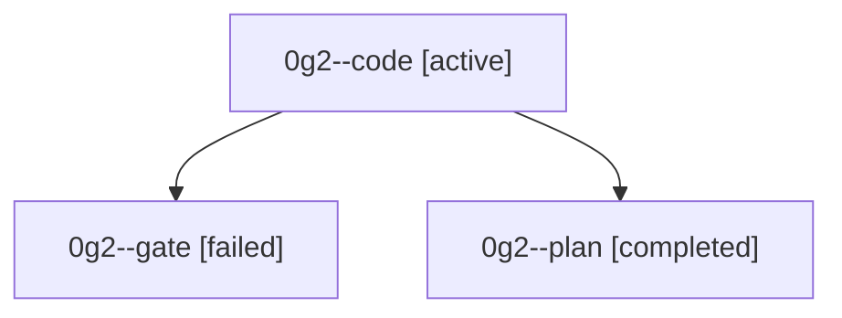

# Family: 0g2

[Agent Hoods](../README.md) / [bbugyi200](../users/bbugyi200/README.md) / [athena](../users/bbugyi200/machines/athena/README.md) / [0g2](../users/bbugyi200/machines/athena/hoods/0g2/README.md) / 0g2

Owner: `bbugyi200.athena` · Hood: `0g2` · Members: 3

## Lineage

The diagram is an optional enhancement; the ordered table below contains the same lineage in accessible text.

| Role | Agent | State | Model / provider | Timing | Commits | Prompt | Chat |
|---|---|---|---|---|---:|---|---|
| code | 0g2--code | active | gpt-5.5 / codex | 2026-08-29T13:20:21.355411+00:00 | [1](../agents/bbugyi200.athena.0g2--code/README.md#commits) | [Prompt](../agents/bbugyi200.athena.0g2--code/prompt.md) | — |
| gate | 0g2--gate | failed | opus / claude | 2026-08-29T13:14:58.080867+00:00 → 2026-08-29T13:20:15.270468+00:00 | 0 | — | [Chat](../agents/bbugyi200.athena.0g2--gate/chat.md) |
| plan | 0g2--plan | completed | opus / claude | 2026-08-29T12:59:19.078022+00:00 → 2026-08-29T13:15:05.011670+00:00 | 0 | [Prompt](../agents/bbugyi200.athena.0g2--plan/prompt.md) | [Chat](../agents/bbugyi200.athena.0g2--plan/chat.md) |

## Commits

| Role | Repo | Commit | Subject | Committed |
|---|---|---|---|---|
| code | sase | [`04c676f`](https://github.com/sase-org/sase/commit/04c676f9c69427c6dd11901fdfb4bff069a3b149) | test(directives): cover bounded wait completion ranges | 2026-08-29 09:58:38 EDT |
