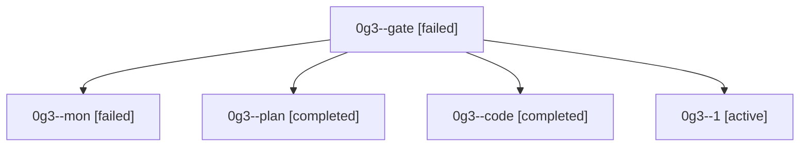

# Family: 0g3

[Agent Hoods](../README.md) / [bbugyi200](../users/bbugyi200/README.md) / [athena](../users/bbugyi200/machines/athena/README.md) / [0g3](../users/bbugyi200/machines/athena/hoods/0g3/README.md) / 0g3

Owner: `bbugyi200.athena` · Hood: `0g3` · Members: 5

## Lineage

The diagram is an optional enhancement; the ordered table below contains the same lineage in accessible text.

| Role | Agent | State | Model / provider | Timing | Commits | Prompt | Chat |
|---|---|---|---|---|---:|---|---|
| gate | 0g3--gate | failed | opus / claude | 2026-08-29T13:42:21.452019+00:00 → 2026-08-29T13:43:35.775826+00:00 | 0 | — | [Chat](../agents/bbugyi200.athena.0g3--gate/chat.md) |
| mon | 0g3--mon | failed | gpt-5.5 / codex | 2026-08-29T14:16:16.333834+00:00 → 2026-08-29T14:41:13.064695+00:00 | 0 | — | [Chat](../agents/bbugyi200.athena.0g3--mon/chat.md) |
| plan | 0g3--plan | completed | opus / claude | 2026-08-29T13:23:49.979793+00:00 → 2026-08-29T13:42:29.400537+00:00 | 0 | [Prompt](../agents/bbugyi200.athena.0g3--plan/prompt.md) | [Chat](../agents/bbugyi200.athena.0g3--plan/chat.md) |
| code | 0g3--code | completed | gpt-5.5 / codex | 2026-08-29T13:43:42.297058+00:00 → 2026-08-29T14:16:24.481778+00:00 | 0 | [Prompt](../agents/bbugyi200.athena.0g3--code/prompt.md) | [Chat](../agents/bbugyi200.athena.0g3--code/chat.md) |
| 1 | 0g3--1 | active | gpt-5.5 / codex | 2026-08-29T14:41:29.139065+00:00 | [1](../agents/bbugyi200.athena.0g3--1/README.md#commits) | [Prompt](../agents/bbugyi200.athena.0g3--1/prompt.md) | — |

## Commits

| Role | Repo | Commit | Subject | Committed |
|---|---|---|---|---|
| 1 | sase | [`d432798`](https://github.com/sase-org/sase/commit/d4327985d50f37797a4782bd98f29ed7bbb9bd99) | fix(tui): make gate shells own decision statuses | 2026-08-29 10:43:32 EDT |
