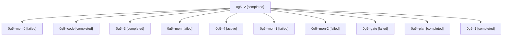

# Family: 0g5

[Agent Hoods](../README.md) / [bbugyi200](../users/bbugyi200/README.md) / [athena](../users/bbugyi200/machines/athena/README.md) / [0g5](../users/bbugyi200/machines/athena/hoods/0g5/README.md) / 0g5

Owner: `bbugyi200.athena` · Hood: `0g5` · Members: 11

## Lineage

The diagram is an optional enhancement; the ordered table below contains the same lineage in accessible text.

| Role | Agent | State | Model / provider | Timing | Commits | Prompt | Chat |
|---|---|---|---|---|---:|---|---|
| 2 | 0g5--2 | completed | grok-4.6 / grok | 2026-08-29T15:58:09.149964+00:00 → 2026-08-29T16:04:26.032581+00:00 | 0 | [Prompt](../agents/bbugyi200.athena.0g5--2/prompt.md) | [Chat](../agents/bbugyi200.athena.0g5--2/chat.md) |
| mon-0 | 0g5--mon-0 | failed | grok-4.6 / grok | 2026-08-29T15:38:09.387657+00:00 → 2026-08-29T15:57:41.524368+00:00 | 0 | — | [Chat](../agents/bbugyi200.athena.0g5--mon-0/chat.md) |
| code | 0g5--code | completed | grok-4.6 / grok | 2026-08-29T14:28:32.364535+00:00 → 2026-08-29T15:29:06.007052+00:00 | 0 | [Prompt](../agents/bbugyi200.athena.0g5--code/prompt.md) | [Chat](../agents/bbugyi200.athena.0g5--code/chat.md) |
| 3 | 0g5--3 | completed | grok-4.6 / grok | 2026-08-29T16:22:53.211540+00:00 → 2026-08-29T16:37:03.651634+00:00 | 0 | [Prompt](../agents/bbugyi200.athena.0g5--3/prompt.md) | [Chat](../agents/bbugyi200.athena.0g5--3/chat.md) |
| mon | 0g5--mon | failed | grok-4.6 / grok | 2026-08-29T15:28:46.239341+00:00 → 2026-08-29T15:31:18.074565+00:00 | 0 | — | [Chat](../agents/bbugyi200.athena.0g5--mon/chat.md) |
| 4 | 0g5--4 | active | grok-4.6 / grok | 2026-08-29T16:55:12.583137+00:00 | [1](../agents/bbugyi200.athena.0g5--4/README.md#commits) | [Prompt](../agents/bbugyi200.athena.0g5--4/prompt.md) | — |
| mon-1 | 0g5--mon-1 | failed | grok-4.6 / grok | 2026-08-29T16:04:03.851883+00:00 → 2026-08-29T16:22:35.284006+00:00 | 0 | — | [Chat](../agents/bbugyi200.athena.0g5--mon-1/chat.md) |
| mon-2 | 0g5--mon-2 | failed | grok-4.6 / grok | 2026-08-29T16:36:41.718045+00:00 → 2026-08-29T16:54:51.612214+00:00 | 0 | — | [Chat](../agents/bbugyi200.athena.0g5--mon-2/chat.md) |
| gate | 0g5--gate | failed | opus / claude | 2026-08-29T14:26:56.270895+00:00 → 2026-08-29T14:28:25.958069+00:00 | 0 | — | [Chat](../agents/bbugyi200.athena.0g5--gate/chat.md) |
| plan | 0g5--plan | completed | opus / claude | 2026-08-29T14:20:03.162822+00:00 → 2026-08-29T14:27:07.413064+00:00 | 0 | [Prompt](../agents/bbugyi200.athena.0g5--plan/prompt.md) | [Chat](../agents/bbugyi200.athena.0g5--plan/chat.md) |
| 1 | 0g5--1 | completed | grok-4.6 / grok | 2026-08-29T15:31:35.150807+00:00 → 2026-08-29T15:38:29.393510+00:00 | 0 | [Prompt](../agents/bbugyi200.athena.0g5--1/prompt.md) | [Chat](../agents/bbugyi200.athena.0g5--1/chat.md) |

## Commits

| Role | Repo | Commit | Subject | Committed |
|---|---|---|---|---|
| 4 | sase | [`1791874`](https://github.com/sase-org/sase/commit/179187499eb9df7fca11551ffe66afc9b4496297) | feat(memory)!: remove unused memory proposal path | 2026-08-29 13:01:49 EDT |
