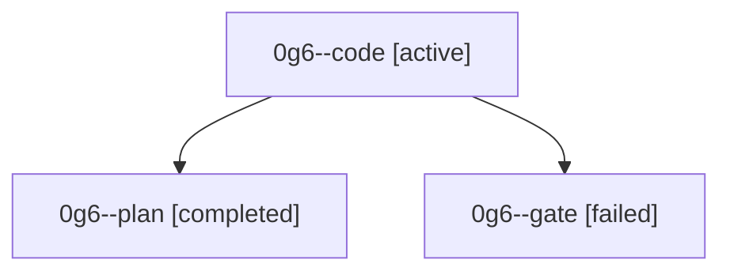

# Family: 0g6

[Agent Hoods](../README.md) / [bbugyi200](../users/bbugyi200/README.md) / [athena](../users/bbugyi200/machines/athena/README.md) / [0g6](../users/bbugyi200/machines/athena/hoods/0g6/README.md) / 0g6

Owner: `bbugyi200.athena` · Hood: `0g6` · Members: 3

## Lineage

The diagram is an optional enhancement; the ordered table below contains the same lineage in accessible text.

| Role | Agent | State | Model / provider | Timing | Commits | Prompt | Chat |
|---|---|---|---|---|---:|---|---|
| code | 0g6--code | active | grok-4.6 / grok | 2026-08-29T14:51:44.649166+00:00 | [1](../agents/bbugyi200.athena.0g6--code/README.md#commits) | [Prompt](../agents/bbugyi200.athena.0g6--code/prompt.md) | — |
| plan | 0g6--plan | completed | opus / claude | 2026-08-29T14:37:04.311123+00:00 → 2026-08-29T14:43:00.181807+00:00 | 0 | [Prompt](../agents/bbugyi200.athena.0g6--plan/prompt.md) | [Chat](../agents/bbugyi200.athena.0g6--plan/chat.md) |
| gate | 0g6--gate | failed | opus / claude | 2026-08-29T14:42:53.326070+00:00 → 2026-08-29T14:51:38.344777+00:00 | 0 | — | [Chat](../agents/bbugyi200.athena.0g6--gate/chat.md) |

## Commits

| Role | Repo | Commit | Subject | Committed |
|---|---|---|---|---|
| code | sase | [`0e47ef6`](https://github.com/sase-org/sase/commit/0e47ef6482937cf35ae29529fcb69ba5b840765a) | docs(memory): collapse repository reminders into one IMPORTANT paragraph | 2026-08-29 11:10:48 EDT |

## Neighbors

| Agent | Relation | State |
|---|---|---|
| [0g6.w0](../agents/bbugyi200.athena.0g6.w0/README.md) | descendant | waiting |
