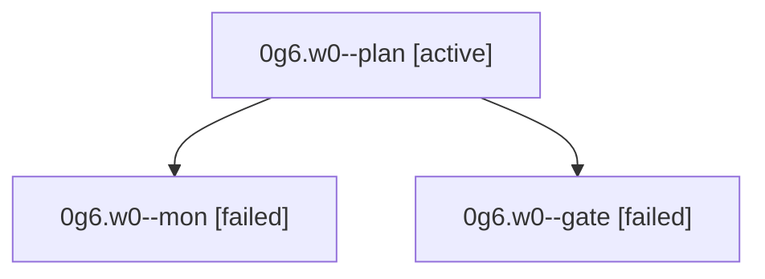

# Family: 0g6.w0

[Agent Hoods](../README.md) / [bbugyi200](../users/bbugyi200/README.md) / [athena](../users/bbugyi200/machines/athena/README.md) / [0g6](../users/bbugyi200/machines/athena/hoods/0g6/README.md) / 0g6.w0

Owner: `bbugyi200.athena` · Hood: `0g6` · Members: 3

## Lineage

The diagram is an optional enhancement; the ordered table below contains the same lineage in accessible text.

| Role | Agent | State | Model / provider | Timing | Commits | Prompt | Chat |
|---|---|---|---|---|---:|---|---|
| plan | 0g6.w0--plan | active | opus / claude | 2026-08-29T15:13:36.294814+00:00 | 0 | [Prompt](../agents/bbugyi200.athena.0g6.w0--plan/prompt.md) | [Chat](../agents/bbugyi200.athena.0g6.w0--plan/chat.md) |
| mon | 0g6.w0--mon | failed | opus / claude | 2026-08-29T15:28:59.202565+00:00 → 2026-08-29T15:31:12.726752+00:00 | 0 | — | [Chat](../agents/bbugyi200.athena.0g6.w0--mon/chat.md) |
| gate | 0g6.w0--gate | failed | opus / claude | 2026-08-29T15:24:49.797229+00:00 → 2026-08-29T15:29:00.064355+00:00 | 0 | — | [Chat](../agents/bbugyi200.athena.0g6.w0--gate/chat.md) |

## Neighbors

| Agent | Relation | State |
|---|---|---|
| [0g6](bbugyi200.athena.0g6.md) (family · 3) | ancestor | active 1, completed 1, failed 1 |
