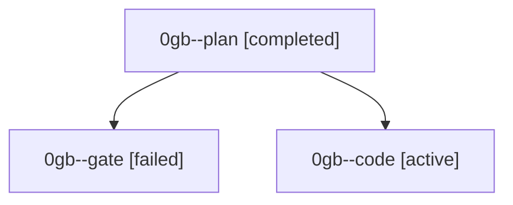

# Family: 0gb

[Agent Hoods](../README.md) / [bbugyi200](../users/bbugyi200/README.md) / [athena](../users/bbugyi200/machines/athena/README.md) / [0gb](../users/bbugyi200/machines/athena/hoods/0gb/README.md) / 0gb

Owner: `bbugyi200.athena` · Hood: `0gb` · Members: 3

## Lineage

The diagram is an optional enhancement; the ordered table below contains the same lineage in accessible text.

| Role | Agent | State | Model / provider | Timing | Commits | Prompt | Chat |
|---|---|---|---|---|---:|---|---|
| plan | 0gb--plan | completed | opus / claude | 2026-08-30T15:02:53.493960+00:00 → 2026-08-30T15:11:09.399441+00:00 | 0 | [Prompt](../agents/bbugyi200.athena.0gb--plan/prompt.md) | [Chat](../agents/bbugyi200.athena.0gb--plan/chat.md) |
| gate | 0gb--gate | failed | opus / claude | 2026-08-30T15:11:02.636562+00:00 → 2026-08-30T15:12:08.664916+00:00 | 0 | — | [Chat](../agents/bbugyi200.athena.0gb--gate/chat.md) |
| code | 0gb--code | active | grok-4.6 / grok | 2026-08-30T15:12:14.889021+00:00 | [1](../agents/bbugyi200.athena.0gb--code/README.md#commits) | [Prompt](../agents/bbugyi200.athena.0gb--code/prompt.md) | — |

## Commits

| Role | Repo | Commit | Subject | Committed |
|---|---|---|---|---|
| code | sase | [`0fd1cc6`](https://github.com/sase-org/sase/commit/0fd1cc6c180b160bd4954a40ce6d07a62f270dfd) | fix(ace): clear the notification tab after R marks it read | 2026-08-30 11:27:57 EDT |
