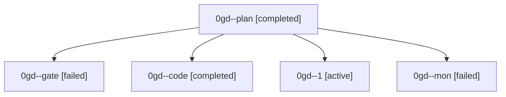

# Family: 0gd

[Agent Hoods](../README.md) / [bbugyi200](../users/bbugyi200/README.md) / [athena](../users/bbugyi200/machines/athena/README.md) / [0gd](../users/bbugyi200/machines/athena/hoods/0gd/README.md) / 0gd

Owner: `bbugyi200.athena` · Hood: `0gd` · Members: 5

## Lineage

The diagram is an optional enhancement; the ordered table below contains the same lineage in accessible text.

| Role | Agent | State | Model / provider | Timing | Commits | Prompt | Chat |
|---|---|---|---|---|---:|---|---|
| plan | 0gd--plan | completed | opus / claude | 2026-08-30T15:10:16.502471+00:00 → 2026-08-30T15:24:51.810722+00:00 | 0 | [Prompt](../agents/bbugyi200.athena.0gd--plan/prompt.md) | [Chat](../agents/bbugyi200.athena.0gd--plan/chat.md) |
| gate | 0gd--gate | failed | opus / claude | 2026-08-30T15:24:43.667396+00:00 → 2026-08-30T15:28:25.827075+00:00 | 0 | — | [Chat](../agents/bbugyi200.athena.0gd--gate/chat.md) |
| code | 0gd--code | completed | grok-4.6 / grok | 2026-08-30T15:28:31.879878+00:00 → 2026-08-30T16:05:22.250070+00:00 | 0 | [Prompt](../agents/bbugyi200.athena.0gd--code/prompt.md) | [Chat](../agents/bbugyi200.athena.0gd--code/chat.md) |
| 1 | 0gd--1 | active | grok-4.6 / grok | 2026-08-30T16:23:38.171101+00:00 | [1](../agents/bbugyi200.athena.0gd--1/README.md#commits) | [Prompt](../agents/bbugyi200.athena.0gd--1/prompt.md) | — |
| mon | 0gd--mon | failed | grok-4.6 / grok | 2026-08-30T16:05:14.328004+00:00 → 2026-08-30T16:23:19.687794+00:00 | 0 | — | [Chat](../agents/bbugyi200.athena.0gd--mon/chat.md) |

## Commits

| Role | Repo | Commit | Subject | Committed |
|---|---|---|---|---|
| 1 | sase | [`fdb962c`](https://github.com/sase-org/sase/commit/fdb962c13ab6827a5ca3b7c3aca3c0d94a5a261c) | fix(tui): keep approved gate shells in the Running bucket | 2026-08-30 12:26:57 EDT |
