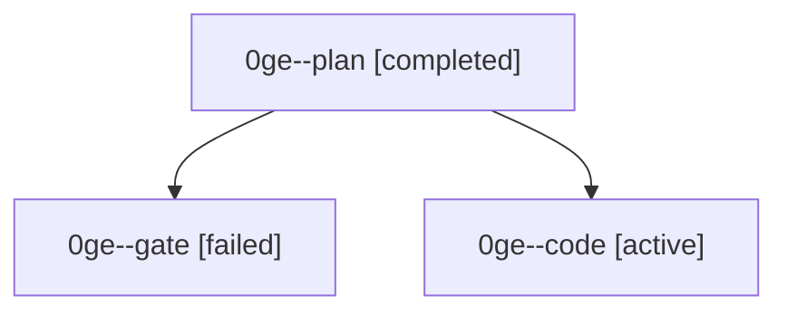

# Family: 0ge

[Agent Hoods](../README.md) / [bbugyi200](../users/bbugyi200/README.md) / [athena](../users/bbugyi200/machines/athena/README.md) / [0ge](../users/bbugyi200/machines/athena/hoods/0ge/README.md) / 0ge

Owner: `bbugyi200.athena` · Hood: `0ge` · Members: 3

## Lineage

The diagram is an optional enhancement; the ordered table below contains the same lineage in accessible text.

| Role | Agent | State | Model / provider | Timing | Commits | Prompt | Chat |
|---|---|---|---|---|---:|---|---|
| plan | 0ge--plan | completed | claude-fable-5 / claude | 2026-09-05T21:19:47.386895+00:00 → 2026-09-05T21:34:03.868530+00:00 | 0 | [Prompt](../agents/bbugyi200.athena.0ge--plan/prompt.md) | [Chat](../agents/bbugyi200.athena.0ge--plan/chat.md) |
| gate | 0ge--gate | failed | claude-fable-5 / claude | 2026-09-05T21:33:50.214332+00:00 → 2026-09-05T21:36:31.699663+00:00 | 0 | — | [Chat](../agents/bbugyi200.athena.0ge--gate/chat.md) |
| code | 0ge--code | active | grok-4.6 / grok | 2026-09-05T21:36:38.665097+00:00 | [1](../agents/bbugyi200.athena.0ge--code/README.md#commits) | [Prompt](../agents/bbugyi200.athena.0ge--code/prompt.md) | — |

## Commits

| Role | Repo | Commit | Subject | Committed |
|---|---|---|---|---|
| code | sase | [`c671169`](https://github.com/sase-org/sase/commit/c6711695aa60c53f6224aa82113c9aa00ff8a977) | feat(ace): remove the Agent Cleanup clan chooser | 2026-09-05 18:16:56 EDT |
