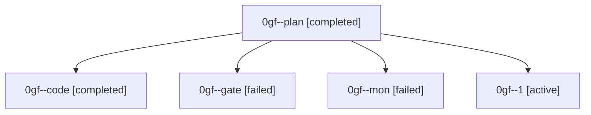

# Family: 0gf

[Agent Hoods](../README.md) / [bbugyi200](../users/bbugyi200/README.md) / [athena](../users/bbugyi200/machines/athena/README.md) / [0gf](../users/bbugyi200/machines/athena/hoods/0gf/README.md) / 0gf

Owner: `bbugyi200.athena` · Hood: `0gf` · Members: 5

## Lineage

The diagram is an optional enhancement; the ordered table below contains the same lineage in accessible text.

| Role | Agent | State | Model / provider | Timing | Commits | Prompt | Chat |
|---|---|---|---|---|---:|---|---|
| plan | 0gf--plan | completed | gpt-6-astra / codex | 2026-09-05T21:37:47.242139+00:00 → 2026-09-05T21:45:13.489456+00:00 | 0 | [Prompt](../agents/bbugyi200.athena.0gf--plan/prompt.md) | [Chat](../agents/bbugyi200.athena.0gf--plan/chat.md) |
| code | 0gf--code | completed | sonnet / claude | 2026-09-05T21:49:50.193273+00:00 → 2026-09-05T22:07:41.869134+00:00 | 0 | [Prompt](../agents/bbugyi200.athena.0gf--code/prompt.md) | [Chat](../agents/bbugyi200.athena.0gf--code/chat.md) |
| gate | 0gf--gate | failed | gpt-6-astra / codex | 2026-09-05T21:45:06.113143+00:00 → 2026-09-05T21:49:43.300579+00:00 | 0 | — | [Chat](../agents/bbugyi200.athena.0gf--gate/chat.md) |
| mon | 0gf--mon | failed | sonnet / claude | 2026-09-05T22:07:15.394955+00:00 → 2026-09-05T22:17:27.911783+00:00 | 0 | — | [Chat](../agents/bbugyi200.athena.0gf--mon/chat.md) |
| 1 | 0gf--1 | active | sonnet / claude | 2026-09-05T22:17:46.955252+00:00 | [1](../agents/bbugyi200.athena.0gf--1/README.md#commits) | [Prompt](../agents/bbugyi200.athena.0gf--1/prompt.md) | — |

## Commits

| Role | Repo | Commit | Subject | Committed |
|---|---|---|---|---|
| 1 | sase | [`ee35836`](https://github.com/sase-org/sase/commit/ee358364ae7b7b87fd9d69b09142c6cee7ed776b) | fix(tui): always hide STARTING agent rows from the Agents tab | 2026-09-05 18:29:41 EDT |
